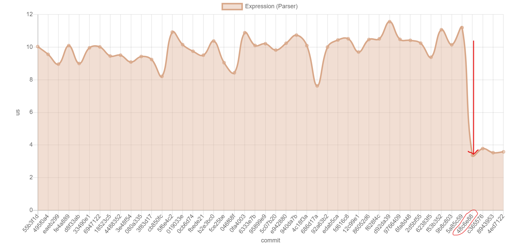

# CHANGELOG

## What's Changed

# [0.14.0 (2022-03-15) - Virtual Machine](https://github.com/boa-dev/boa/compare/v0.13...v0.14)

<!-- Release notes generated using configuration in .github/release.yml at main -->

### Feature Enhancements

- Implement functions for vm by @HalidOdat in [#1433](https://github.com/boa-dev/boa/pull/1433)
- Implement Object.getOwnPropertyNames and Object.getOwnPropertySymbols by @kevinputera in [#1606](https://github.com/boa-dev/boa/pull/1606)
- Implement `Symbol.prototype.valueOf` by @hle0 in [#1618](https://github.com/boa-dev/boa/pull/1618)
- Implement Array.prototype.at() by @nekevss in [#1613](https://github.com/boa-dev/boa/pull/1613)
- Implement Array.from by @nrabulinski [#1831](https://github.com/boa-dev/boa/pull/1831)
- Implement String.fromCharCode by @hle0 in [#1619](https://github.com/boa-dev/boa/pull/1619)
- Implement `Typed Array` built-in by @Razican in [#1552](https://github.com/boa-dev/boa/pull/1552)
- Implement arguments exotic objects by @jedel1043 in [#1522](https://github.com/boa-dev/boa/pull/1522)
- Allow `BindingPattern`s as `CatchParameter` by @lowr in [#1628](https://github.com/boa-dev/boa/pull/1628)
- Implement `Symbol.prototype[ @@toPrimitive ]` by @Nimpruda in [#1634](https://github.com/boa-dev/boa/pull/1634)
- Implement Generator parsing by @raskad in [#1575](https://github.com/boa-dev/boa/pull/1575)
- Implement Object.hasOwn and improve Object.prototype.hasOwnProperty by @kevinputera in [#1639](https://github.com/boa-dev/boa/pull/1639)
- Hashbang lexer support by @nekevss in [#1631](https://github.com/boa-dev/boa/pull/1631)
- Implement `delete` operator in the vm by @raskad in [#1649](https://github.com/boa-dev/boa/pull/1649)
- Implement Object.fromEntries by @kevinputera in [#1660](https://github.com/boa-dev/boa/pull/1660)
- Initial implementation for increment/decrement in VM by @abhishekc-sharma in [#1621](https://github.com/boa-dev/boa/pull/1621)
- Implement `Proxy` object by @raskad in [#1664](https://github.com/boa-dev/boa/pull/1664)
- Implement object literals for vm by @raskad in [#1668](https://github.com/boa-dev/boa/pull/1668)
- Implement Array findLast and findLastIndex by @bsinky in [#1665](https://github.com/boa-dev/boa/pull/1665)
- Implement `DataView` built-in object by @Nimpruda in [#1662](https://github.com/boa-dev/boa/pull/1662)
- Clean-up contribution guidelines, dependencies, Test262, MSRV by @Razican in [#1683](https://github.com/boa-dev/boa/pull/1683)
- Implement Async Generator Parsing by @nekevss in [#1669](https://github.com/boa-dev/boa/pull/1669)
- Implement prototype of `Intl` built-in by @hle0 in [#1622](https://github.com/boa-dev/boa/pull/1622)
- Add limited console.trace implementation by @osman-turan in [#1623](https://github.com/boa-dev/boa/pull/1623)
- Allow `BindingPattern` in function parameters by @am-a-man in [#1666](https://github.com/boa-dev/boa/pull/1666)
- Small test ux improvements by @orndorffgrant in [#1704](https://github.com/boa-dev/boa/pull/1704)
- Implement missing vm operations by @raskad in [#1697](https://github.com/boa-dev/boa/pull/1697)
- Added fallible allocation to data blocks by @Razican in [#1728](https://github.com/boa-dev/boa/pull/1728)
- Document CodeBlock by @TheDoctor314 in [#1691](https://github.com/boa-dev/boa/pull/1691)
- Generic `JsResult<R>` in `context.throw_` methods by @HalidOdat in [#1734](https://github.com/boa-dev/boa/pull/1734)
- Implement `String.raw( template, ...substitutions )` by @HalidOdat in [#1741](https://github.com/boa-dev/boa/pull/1741)
- Updated test262 suite and dependencies by @Razican in [#1755](https://github.com/boa-dev/boa/pull/1755)
- Lexer string interning by @Razican in [#1758](https://github.com/boa-dev/boa/pull/1758)
- Adjust `compile` and `execute` to avoid clones by @Razican in [#1778](https://github.com/boa-dev/boa/pull/1778)
- Interner support in the parser by @Razican in [#1765](https://github.com/boa-dev/boa/pull/1765)
- Convert `Codeblock` variables to `Sym` by @raskad in [#1798](https://github.com/boa-dev/boa/pull/1798)
- Using production builds for WebAssembly by @Razican in [#1825](https://github.com/boa-dev/boa/pull/1825)
- Give the arrow function its proper name by @rumpl in [#1832](https://github.com/boa-dev/boa/pull/1832)
- Unwrap removal by @Razican in [#1842](https://github.com/boa-dev/boa/pull/1842)
- Feature `JsArray` by @HalidOdat in [#1746](https://github.com/boa-dev/boa/pull/1746)
- Rename "Boa" to boa_engine, moved GC and profiler to their crates by @Razican in [#1844](https://github.com/boa-dev/boa/pull/1844)
- Added conversions from and to serde_json's Value type by @Razican in [#1851](https://github.com/boa-dev/boa/pull/1851)
- Toggleable `JsValue` internals displaying by @HalidOdat in [#1865](https://github.com/boa-dev/boa/pull/1865)
- Implement generator execution by @raskad in [#1790](https://github.com/boa-dev/boa/pull/1790)
- Feature arrays with empty elements by @HalidOdat in [#1870](https://github.com/boa-dev/boa/pull/1870)
- Removed reference counted pointers from `JsValue` variants by @Razican in [#1866](https://github.com/boa-dev/boa/pull/1866)
- Implement `Object.prototype.toLocaleString()` by @HalidOdat in [#1875](https://github.com/boa-dev/boa/pull/1875)
- Implement `AggregateError` by @HalidOdat in [#1888](https://github.com/boa-dev/boa/pull/1888)
- Implement destructing assignments for assignment expressions by @raskad in [#1895](https://github.com/boa-dev/boa/pull/1895)
- Added boa examples by @elasmojs in [#1161](https://github.com/boa-dev/boa/pull/1161)

### Bug Fixes

- Fix BigInt and Number comparison by @HalidOdat [#1887](https://github.com/boa-dev/boa/pull/1887)
- Fix broken structure links in the documentation by @abhishekc-sharma in [#1612](https://github.com/boa-dev/boa/pull/1612)
- Use function name from identifiers in assignment expressions by @raskad [#1908](https://github.com/boa-dev/boa/pull/1908)
- Fix integer parsing by @nrabulinski in [#1614](https://github.com/boa-dev/boa/pull/1614)
- Fix `Number.toExponential` and `Number.toFixed` by @nrabulinski in [#1620](https://github.com/boa-dev/boa/pull/1620)
- Badge updates by @atouchet in [#1638](https://github.com/boa-dev/boa/pull/1638)
- refactor: fix construct_error functions by @RageKnify in [#1703](https://github.com/boa-dev/boa/pull/1703)
- Fix internal vm tests by @raskad in [#1718](https://github.com/boa-dev/boa/pull/1718)
- Removed a bunch of warnings and clippy errors by @Razican in [#1754](https://github.com/boa-dev/boa/pull/1754)
- Fix some broken links in the profiler documentation by @Razican in [#1762](https://github.com/boa-dev/boa/pull/1762)
- Add proxy handling in `isArray` method by @raskad in [#1777](https://github.com/boa-dev/boa/pull/1777)
- Copy/paste fix in Proxy error message by @icecream17 in [#1787](https://github.com/boa-dev/boa/pull/1787)
- Fixed #1768 by @Razican in [#1820](https://github.com/boa-dev/boa/pull/1820)
- Fix string.prototype methods and add static string methods by @jevancc in [#1123](https://github.com/boa-dev/boa/pull/1123)
- Handle allocation errors by @y21 in [#1850](https://github.com/boa-dev/boa/pull/1850)
- Fix wasm use outside browsers by @Razican in [#1846](https://github.com/boa-dev/boa/pull/1846)
- Add assertion to check that a break label is identified at compile-time by @VTCAKAVSMoACE in [#1852](https://github.com/boa-dev/boa/pull/1852)
- Correct reference error message by @aaronmunsters in [#1855](https://github.com/boa-dev/boa/pull/1855)
- Fixing main branch workflows by @Razican in [#1858](https://github.com/boa-dev/boa/pull/1858)
- Correct pop_on_return behaviour by @VTCAKAVSMoACE in [#1853](https://github.com/boa-dev/boa/pull/1853)
- Fix equality between objects and `undefined` or `null` by @HalidOdat in [#1872](https://github.com/boa-dev/boa/pull/1872)
- Removing the panic in favour of an error result by @Razican in [#1874](https://github.com/boa-dev/boa/pull/1874)
- Make `Object.getOwnPropertyDescriptors` spec compliant by @HalidOdat in [#1876](https://github.com/boa-dev/boa/pull/1876)
- Make `Error` and `%NativeError%` spec compliant by @HalidOdat in [#1879](https://github.com/boa-dev/boa/pull/1879)
- Fix `Number.prototype.toString` when passing `undefined` as radix by @HalidOdat in [#1877](https://github.com/boa-dev/boa/pull/1877)
- Cleanup vm stack on function return by @raskad in [#1880](https://github.com/boa-dev/boa/pull/1880)
- `%NativeError%.[[prototype]]` should be `Error` constructor by @HalidOdat in [#1883](https://github.com/boa-dev/boa/pull/1883)
- Make `StringToNumber` spec compliant by @HalidOdat in [#1881](https://github.com/boa-dev/boa/pull/1881)
- Fix `PropertyKey` to `JsValue` conversion by @HalidOdat in [#1886](https://github.com/boa-dev/boa/pull/1886)
- Make iterator spec complaint by @HalidOdat in [#1889](https://github.com/boa-dev/boa/pull/1889)
- Implement `Number.parseInt` and `Number.parseFloat` by @HalidOdat in [#1894](https://github.com/boa-dev/boa/pull/1894)
- Fix unreachable panics in compile_access by @VTCAKAVSMoACE in [#1861](https://github.com/boa-dev/boa/pull/1861)
- Continue panic fixes by @VTCAKAVSMoACE in [#1896](https://github.com/boa-dev/boa/pull/1896)
- Deny const declarations without initializer inside for loops by @jedel1043 in [#1903](https://github.com/boa-dev/boa/pull/1903)
- Fix try/catch/finally related bugs and add tests by @jedel1043 in [#1901](https://github.com/boa-dev/boa/pull/1901)
- Compile StatementList after parse passes on negative tests by @raskad in [#1906](https://github.com/boa-dev/boa/pull/1906)
- Prevent breaks without loop or switch from causing panics by @VTCAKAVSMoACE in [#1860](https://github.com/boa-dev/boa/pull/1860)
- Fix postfix increment and decrement return values by @raskad in [#1913](https://github.com/boa-dev/boa/pull/1913)

### Internal Improvements

- Rewrite initialization of builtins to use the `BuiltIn` trait by @jedel1043 in [#1586](https://github.com/boa-dev/boa/pull/1586)
- Unify object creation with `empty` and `from_proto_and_data` methods by @jedel1043 in [#1567](https://github.com/boa-dev/boa/pull/1567)
- VM Tidy Up by @jasonwilliams in [#1610](https://github.com/boa-dev/boa/pull/1610)
- Fix master refs to main by @jasonwilliams in [#1637](https://github.com/boa-dev/boa/pull/1637)
- Refresh vm docs and fix bytecode trace output by @raskad [#1921](https://github.com/boa-dev/boa/pull/1921)
- Change type of object prototypes to `Option<JsObject>` by @jedel1043 in [#1640](https://github.com/boa-dev/boa/pull/1640)
- Refactor `Function` internal methods and implement `BoundFunction` objects by @jedel1043 in [#1583](https://github.com/boa-dev/boa/pull/1583)
- change that verbosity comparison to > 2 by @praveenbakkal in [#1680](https://github.com/boa-dev/boa/pull/1680)
- Respect rust 1.56 by @RageKnify in [#1681](https://github.com/boa-dev/boa/pull/1681)
- Add bors to CI by @RageKnify in [#1684](https://github.com/boa-dev/boa/pull/1684)
- Adding VM conformance output to PR checks by @Razican in [#1685](https://github.com/boa-dev/boa/pull/1685)
- Start removing non-VM path by @jasonwilliams in [#1747](https://github.com/boa-dev/boa/pull/1747)
- Using upstream benchmark action by @Razican in [#1753](https://github.com/boa-dev/boa/pull/1753)
- Fix bors hanging by @RageKnify in [#1767](https://github.com/boa-dev/boa/pull/1767)
- add more timers on object functions by @jasonwilliams in [#1775](https://github.com/boa-dev/boa/pull/1775)
- Update the PR benchmarks action by @Razican in [#1774](https://github.com/boa-dev/boa/pull/1774)
- General code clean-up and new lint addition by @Razican in [#1809](https://github.com/boa-dev/boa/pull/1809)
- Reduced the size of AST nodes by @Razican in [#1821](https://github.com/boa-dev/boa/pull/1821)
- Using the new formatting arguments from Rust 1.58 by @Razican in [#1834](https://github.com/boa-dev/boa/pull/1834)
- Rework RegExp struct to include bitflags field by @aaronmunsters in [#1837](https://github.com/boa-dev/boa/pull/1837)
- Ignore wastefull `RegExp` tests by @raskad in [#1840](https://github.com/boa-dev/boa/pull/1840)
- Refactor the environment for runtime performance by @raskad in [#1829](https://github.com/boa-dev/boa/pull/1829)
- Refactor mapped `Arguments` object by @raskad in [#1849](https://github.com/boa-dev/boa/pull/1849)
- Fixed dependabot for submodule by @Razican in [#1856](https://github.com/boa-dev/boa/pull/1856)
- Refactorings for Rust 1.59 by @RageKnify in [#1867](https://github.com/boa-dev/boa/pull/1867)
- Removing internal deprecated functions by @HalidOdat in [#1854](https://github.com/boa-dev/boa/pull/1854)
- Remove `toInteger` and document the `string` builtin by @jedel1043 in [#1884](https://github.com/boa-dev/boa/pull/1884)
- Extract `Intrinsics` struct from `Context` and cleanup names by @jedel1043 in [#1890](https://github.com/boa-dev/boa/pull/1890)

**Full Changelog**: https://github.com/boa-dev/boa/compare/v0.13...v0.14

# [0.13.0 (2021-09-30) - Many new features and refactors](https://github.com/boa-dev/boa/compare/v0.12.0...v0.13.0)

Feature Enhancements:

- [FEATURE #1526](https://github.com/boa-dev/boa/pull/1526): Implement ComputedPropertyName for accessor properties in ObjectLiteral (@raskad)
- [FEATURE #1365](https://github.com/boa-dev/boa/pull/1365): Implement splice method (@neeldug)
- [FEATURE #1364](https://github.com/boa-dev/boa/pull/1364): Implement spread for objects (@FrancisMurillo)
- [FEATURE #1525](https://github.com/boa-dev/boa/pull/1525): Implement Object.preventExtensions() and Object.isExtensible() (@HalidOdat)
- [FEATURE #1508](https://github.com/boa-dev/boa/pull/1508): Implement Object.values() (@HalidOdat)
- [FEATURE #1332](https://github.com/boa-dev/boa/pull/1332): Implement Array.prototype.sort (@jedel1043)
- [FEATURE #1417](https://github.com/boa-dev/boa/pull/1471): Implement Object.keys and Object.entries (@skyne98)
- [FEATURE #1406](https://github.com/boa-dev/boa/pull/1406): Implement destructuring assignments (@raskad)
- [FEATURE #1469](https://github.com/boa-dev/boa/pull/1469): Implement String.prototype.replaceAll (@raskad)
- [FEATURE #1442](https://github.com/boa-dev/boa/pull/1442): Implement closure functions (@HalidOdat)
- [FEATURE #1390](https://github.com/boa-dev/boa/pull/1390): Implement RegExp named capture groups (@raskad)
- [FEATURE #1424](https://github.com/boa-dev/boa/pull/1424): Implement Symbol.for and Symbol.keyFor (@HalidOdat)
- [FEATURE #1375](https://github.com/boa-dev/boa/pull/1375): Implement `at` method for string (@neeldug)
- [FEATURE #1369](https://github.com/boa-dev/boa/pull/1369): Implement normalize method (@neeldug)
- [FEATURE #1334](https://github.com/boa-dev/boa/pull/1334): Implement Array.prototype.copyWithin (@jedel1043)
- [FEATURE #1326](https://github.com/boa-dev/boa/pull/1326): Implement get RegExp[@@species] (@raskad)
- [FEATURE #1314](https://github.com/boa-dev/boa/pull/1314): Implement RegExp.prototype [ @@search ] ( string ) (@raskad)
- [FEATURE #1451](https://github.com/boa-dev/boa/pull/1451): Feature prelude module (@HalidOdat)
- [FEATURE #1523](https://github.com/boa-dev/boa/pull/1523): Allow moving NativeObject variables into closures as external captures (@jedel1043)

Bug Fixes:

- [BUG #1521](https://github.com/boa-dev/boa/pull/1521): Added "js" feature for getrandom for WebAssembly builds (@Razican)
- [BUG #1528](https://github.com/boa-dev/boa/pull/1528): Always return undefined from functions that do not return (@raskad)
- [BUG #1518](https://github.com/boa-dev/boa/pull/1518): Moving a JsObject inside a closure caused a panic (@jedel1043)
- [BUG #1502](https://github.com/boa-dev/boa/pull/1502): Adjust EnumerableOwnPropertyNames to use all String type property keys (@raskad)
- [BUG #1415](https://github.com/boa-dev/boa/pull/1415): Fix panic on bigint size (@neeldug)
- [BUG #1477](https://github.com/boa-dev/boa/pull/1477): Properly handle NaN in new Date() (@raskad)
- [BUG #1449](https://github.com/boa-dev/boa/pull/1449): Make Array.prototype methods spec compliant (@HalidOdat)
- [BUG #1353](https://github.com/boa-dev/boa/pull/1353): Make Array.prototype.concat spec compliant (@neeldug)
- [BUG #1384](https://github.com/boa-dev/boa/pull/1384): bitwise not operation (spec improvements) (@neeldug)
- [BUG #1374](https://github.com/boa-dev/boa/pull/1374): Match and regexp construct fixes (@neeldug)
- [BUG #1366](https://github.com/boa-dev/boa/pull/1366): Use lock for map iteration (@joshwd36)
- [BUG #1360](https://github.com/boa-dev/boa/pull/1360): Adjust a comment to be next to the correct module (@teymour-aldridge)
- [BUG #1349](https://github.com/boa-dev/boa/pull/1349): Fixes Array.protoype.includes (@neeldug)
- [BUG #1348](https://github.com/boa-dev/boa/pull/1348): Fixes unshift maximum size (@neeldug)
- [BUG #1339](https://github.com/boa-dev/boa/pull/1339): Scripts should not be considered in a block (@macmv)
- [BUG #1312](https://github.com/boa-dev/boa/pull/1312): Fix display for nodes (@macmv)
- [BUG #1347](https://github.com/boa-dev/boa/pull/1347): Fix stringpad abstract operation (@neeldug)
- [BUG #1584](https://github.com/boa-dev/boa/pull/1584): Refactor the Math builtin object (spec compliant) (@jedel1043)
- [BUG #1535](https://github.com/boa-dev/boa/pull/1535): Refactor JSON.parse (@raskad)
- [BUG #1572](https://github.com/boa-dev/boa/pull/1572): Refactor builtin Map intrinsics to follow more closely the spec (@jedel1043)
- [BUG #1445](https://github.com/boa-dev/boa/pull/1445): improve map conformance without losing perf (@neeldug)
- [BUG #1488](https://github.com/boa-dev/boa/pull/1488): Date refactor (@raskad)
- [BUG #1463](https://github.com/boa-dev/boa/pull/1463): Return function execution result from constructor if the function returned (@raskad)
- [BUG #1434](https://github.com/boa-dev/boa/pull/1434): Refactor regexp costructor (@raskad)
- [BUG #1350](https://github.com/boa-dev/boa/pull/1350): Refactor / Implement RegExp functions (@RageKnify) (@raskad)
- [BUG #1331](https://github.com/boa-dev/boa/pull/1331): Implement missing species getters (@raskad)

Internal Improvements:

- [INTERNAL #1569](https://github.com/boa-dev/boa/pull/1569): Refactor EnvironmentRecordTrait functions (@raskad)
- [INTERNAL #1464](https://github.com/boa-dev/boa/pull/1464): Optimize integer negation (@HalidOdat)
- [INTERNAL #1550](https://github.com/boa-dev/boa/pull/1550): Add strict mode flag to Context (@raskad)
- [INTERNAL #1561](https://github.com/boa-dev/boa/pull/1561): Implement abstract operation GetPrototypeFromConstructor (@jedel1043)
- [INTERNAL #1309](https://github.com/boa-dev/boa/pull/1309): Implement Display for function objects(@kvnvelasco)
- [INTERNAL #1492](https://github.com/boa-dev/boa/pull/1492): Implement new get_or_undefined method for `JsValue` (@jedel1043)
- [INTERNAL #1553](https://github.com/boa-dev/boa/pull/1553): Fix benchmark action in CI (@jedel1043)
- [INTERNAL #1547](https://github.com/boa-dev/boa/pull/1547): Replace FxHashMap with IndexMap in object properties (@raskad)
- [INTERNAL #1435](https://github.com/boa-dev/boa/pull/1435): Constant JsStrings (@HalidOdat)
- [INTERNAL #1499](https://github.com/boa-dev/boa/pull/1499): Updated the Test262 submodule (@Razican)
- [INTERNAL #1458](https://github.com/boa-dev/boa/pull/1458): Refactor the JS testing system (@bartlomieju)
- [INTERNAL #1485](https://github.com/boa-dev/boa/pull/1485): Implement abstract operation CreateArrayFromList (@jedel1043)
- [INTERNAL #1465](https://github.com/boa-dev/boa/pull/1465): Feature throw Error object (@HalidOdat)
- [INTERNAL #1493](https://github.com/boa-dev/boa/pull/1493): Rename boa::Result to JsResult (@bartlomieju)
- [INTERNAL #1457](https://github.com/boa-dev/boa/pull/1457): Rename Value to JsValue (@HalidOdat)
- [INTERNAL #1460](https://github.com/boa-dev/boa/pull/1460): Change StringGetOwnProperty to produce the same strings that the lexer produces (@raskad)
- [INTERNAL #1425](https://github.com/boa-dev/boa/pull/1425): Extract PropertyMap struct from Object (@jedel1043)
- [INTERNAL #1432](https://github.com/boa-dev/boa/pull/1432): Proposal of new PropertyDescriptor design (@jedel1043)
- [INTERNAL #1383](https://github.com/boa-dev/boa/pull/1383): clippy lints and cleanup of old todos (@neeldug)
- [INTERNAL #1346](https://github.com/boa-dev/boa/pull/1346): Implement gh-page workflow on release (@FrancisMurillo)
- [INTERNAL #1422](https://github.com/boa-dev/boa/pull/1422): Refactor internal methods and make some builtins spec compliant (@HalidOdat)
- [INTERNAL #1419](https://github.com/boa-dev/boa/pull/1419): Fix DataDescriptor Value to possibly be empty (@raskad)
- [INTERNAL #1357](https://github.com/boa-dev/boa/pull/1357): Add Example to Execute a Function of a Script File (@schrieveslaach)
- [INTERNAL #1408](https://github.com/boa-dev/boa/pull/1408): Refactor JavaScript bigint rust type (@HalidOdat)
- [INTERNAL #1380](https://github.com/boa-dev/boa/pull/1380): Custom JavaScript string rust type (@HalidOdat)
- [INTERNAL #1382](https://github.com/boa-dev/boa/pull/1382): Refactor JavaScript symbol rust type (@HalidOdat)
- [INTERNAL #1361](https://github.com/boa-dev/boa/pull/1361): Redesign bytecode virtual machine (@HalidOdat)
- [INTERNAL #1381](https://github.com/boa-dev/boa/pull/1381): Fixed documentation warnings (@Razican)
- [INTERNAL #1352](https://github.com/boa-dev/boa/pull/1352): Respect Rust 1.53 (@RageKnify)
- [INTERNAL #1356](https://github.com/boa-dev/boa/pull/1356): Respect Rust fmt updates (@RageKnify)
- [INTERNAL #1338](https://github.com/boa-dev/boa/pull/1338): Fix cargo check errors (@neeldug)
- [INTERNAL #1329](https://github.com/boa-dev/boa/pull/1329): Allow Value.set_field to throw (@raskad)
- [INTERNAL #1333](https://github.com/boa-dev/boa/pull/1333): adds condition to avoid triggers from dependabot (@neeldug)
- [INTERNAL #1337](https://github.com/boa-dev/boa/pull/1337): Fix github actions (@neeldug)

# [0.12.0 (2021-06-07) - `Set`, accessors, `@@toStringTag` and no more panics](https://github.com/boa-dev/boa/compare/v0.11.0...v0.12.0)

Feature Enhancements:

- [FEATURE #1085](https://github.com/boa-dev/boa/pull/1085): Add primitive promotion for method calls on `GetField` (@RageKnify)
- [FEATURE #1033](https://github.com/boa-dev/boa/pull/1033): Implement `Reflect` built-in object (@tofpie)
- [FEATURE #1151](https://github.com/boa-dev/boa/pull/1151): Fully implement `EmptyStatement` (@SamuelQZQ)
- [FEATURE #1158](https://github.com/boa-dev/boa/pull/1158): Include name in verbose results output of `boa-tester` (@0x7D2B)
- [FEATURE #1225](https://github.com/boa-dev/boa/pull/1225): Implement `Math[ @@toStringTag ]` (@HalidOdat)
- [FEATURE #1224](https://github.com/boa-dev/boa/pull/1224): Implement `JSON[ @@toStringTag ]` (@HalidOdat)
- [FEATURE #1222](https://github.com/boa-dev/boa/pull/1222): Implement `Symbol.prototype.description` accessor (@HalidOdat)
- [FEATURE #1221](https://github.com/boa-dev/boa/pull/1221): Implement `RegExp` flag accessors (@HalidOdat)
- [FEATURE #1240](https://github.com/boa-dev/boa/pull/1240): Stop ignoring a bunch of tests (@Razican)
- [FEATURE #1132](https://github.com/boa-dev/boa/pull/1132): Implement `Array.prototype.flat`/`flatMap` (@davimiku)
- [FEATURE #1235](https://github.com/boa-dev/boa/pull/1235): Implement `Object.assign( target, ...sources )` (@HalidOdat)
- [FEATURE #1243](https://github.com/boa-dev/boa/pull/1243): Cross realm symbols (@HalidOdat)
- [FEATURE #1249](https://github.com/boa-dev/boa/pull/1249): Implement `Map.prototype[ @@toStringTag ]` (@wylie39)
- [FEATURE #1111](https://github.com/boa-dev/boa/pull/1111): Implement `Set` builtin object (@RageKnify)
- [FEATURE #1265](https://github.com/boa-dev/boa/pull/1265): Implement `BigInt.prototype[ @@toStringTag ]` (@n14littl)
- [FEATURE #1102](https://github.com/boa-dev/boa/pull/1102): Support Unicode escape in identifier names (@jevancc)
- [FEATURE #1273](https://github.com/boa-dev/boa/pull/1273): Add default parameter support (@0x7D2B)
- [FEATURE #1292](https://github.com/boa-dev/boa/pull/1292): Implement `symbol.prototype[ @@ToStringTag ]` (@moadmmh)
- [FEATURE #1291](https://github.com/boa-dev/boa/pull/1291): Support `GetOwnProperty` for `string` exotic object (@jarkonik)
- [FEATURE #1296](https://github.com/boa-dev/boa/pull/1296): Added the `$262` object to the Test262 test runner (@Razican)
- [FEATURE #1127](https://github.com/boa-dev/boa/pull/1127): Implement `Array.of` (@camc)

Bug Fixes:

- [BUG #1071](https://github.com/boa-dev/boa/pull/1071): Fix attribute configurable of the length property of arguments (@tofpie)
- [BUG #1073](https://github.com/boa-dev/boa/pull/1073): Fixed spelling (@vishalsodani)
- [BUG #1072](https://github.com/boa-dev/boa/pull/1072): Fix `get`/`set` as short method name in `object` (@tofpie)
- [BUG #1077](https://github.com/boa-dev/boa/pull/1077): Fix panics from multiple borrows of `Map` (@joshwd36)
- [BUG #1079](https://github.com/boa-dev/boa/pull/1079): Fix lexing escapes in string literal (@jevancc)
- [BUG #1075](https://github.com/boa-dev/boa/pull/1075): Fix out-of-range panics of `Date` (@jevancc)
- [BUG #1084](https://github.com/boa-dev/boa/pull/1084): Fix line terminator in string literal (@jevancc)
- [BUG #1110](https://github.com/boa-dev/boa/pull/1110): Fix parsing floats panics and bugs (@jevancc)
- [BUG #1202](https://github.com/boa-dev/boa/pull/1202): Fix a typo in `gc.rs` (@teymour-aldridge)
- [BUG #1201](https://github.com/boa-dev/boa/pull/1201): Return optional value in `to_json` functions (@fermian)
- [BUG #1223](https://github.com/boa-dev/boa/pull/1223): Update cli name in Readme (@sphinxc0re)
- [BUG #1175](https://github.com/boa-dev/boa/pull/1175): Handle early errors for declarations in `StatementList` (@0x7D2B)
- [BUG #1270](https://github.com/boa-dev/boa/pull/1270): Fix `Context::register_global_function()` (@HalidOdat)
- [BUG #1135](https://github.com/boa-dev/boa/pull/1135): Fix of instructions.rs comment, to_precision impl and rfc changes (@NathanRoyer)
- [BUG #1272](https://github.com/boa-dev/boa/pull/1272): Fix `Array.prototype.filter` (@tofpie & @Razican)
- [BUG #1280](https://github.com/boa-dev/boa/pull/1280): Fix slice index panic in `add_rest_param` (@0x7D2B)
- [BUG #1284](https://github.com/boa-dev/boa/pull/1284): Fix `GcObject` `to_json` mutable borrow panic (@0x7D2B)
- [BUG #1283](https://github.com/boa-dev/boa/pull/1283): Fix panic in regex execution (@0x7D2B)
- [BUG #1286](https://github.com/boa-dev/boa/pull/1286): Fix construct usage (@0x7D2B)
- [BUG #1288](https://github.com/boa-dev/boa/pull/1288): Fixed `Math.hypot.length` bug (@moadmmh)
- [BUG #1285](https://github.com/boa-dev/boa/pull/1285): Fix environment record panics (@0x7D2B)
- [BUG #1302](https://github.com/boa-dev/boa/pull/1302): Fix VM branch (@jasonwilliams)

Internal Improvements:

- [INTERNAL #1067](https://github.com/boa-dev/boa/pull/1067): Change `Realm::global_object` field from `Value` to `GcObject` (@RageKnify)
- [INTERNAL #1048](https://github.com/boa-dev/boa/pull/1048): VM Trace output fixes (@jasonwilliams)
- [INTERNAL #1109](https://github.com/boa-dev/boa/pull/1109): Define all property methods of constructors (@RageKnify)
- [INTERNAL #1126](https://github.com/boa-dev/boa/pull/1126): Remove unnecessary wraps for non built-in functions (@RageKnify)
- [INTERNAL #1044](https://github.com/boa-dev/boa/pull/1044): Removed duplicated code in `vm.run` using macros (@stephanemagnenat)
- [INTERNAL #1103](https://github.com/boa-dev/boa/pull/1103): Lazy evaluation for cooked template string (@jevancc)
- [INTERNAL #1156](https://github.com/boa-dev/boa/pull/1156): Rework environment records (@0x7D2B)
- [INTERNAL #1181](https://github.com/boa-dev/boa/pull/1181): Merge `Const`/`Let`/`Var` `DeclList` into `DeclarationList` (@0x7D2B)
- [INTERNAL #1234](https://github.com/boa-dev/boa/pull/1234): Separate `Symbol` builtin (@HalidOdat)
- [INTERNAL #1131](https://github.com/boa-dev/boa/pull/1131): Make environment methods take `&mut Context` (@HalidOdat)
- [INTERNAL #1271](https://github.com/boa-dev/boa/pull/1271): Make `same_value` and `same_value_zero` static methods (@HalidOdat)
- [INTERNAL #1276](https://github.com/boa-dev/boa/pull/1276): Cleanup (@Razican)
- [INTERNAL #1279](https://github.com/boa-dev/boa/pull/1279): Add test comparison to Test262 result compare (@Razican)
- [INTERNAL #1293](https://github.com/boa-dev/boa/pull/1293): Fix test262 comment formatting (@0x7D2B)
- [INTERNAL #1294](https://github.com/boa-dev/boa/pull/1294): Don't consider panic fixes as "new failures" (@Razican)

# [0.11.0 (2021-01-14) - Faster Parsing & Better compliance](https://github.com/boa-dev/boa/compare/v0.10.0...v0.11.0)

Feature Enhancements:

- [FEATURE #836](https://github.com/boa-dev/boa/pull/836):
  Async/Await parse (@Lan2u)
- [FEATURE #704](https://github.com/boa-dev/boa/pull/704):
  Implement for...of loops (@joshwd36)
- [FEATURE #770](https://github.com/boa-dev/boa/pull/770):
  Support for symbols as property keys for `Object.defineProperty` (@georgeroman)
- [FEATURE #717](https://github.com/boa-dev/boa/pull/717):
  Strict Mode Lex/Parse (@Lan2u)
- [FEATURE #800](https://github.com/boa-dev/boa/pull/800):
  Implement `console` crate feature - Put `console` object behind a feature flag (@HalidOdat)
- [FEATURE #804](https://github.com/boa-dev/boa/pull/804):
  Implement `EvalError` (@HalidOdat)
- [FEATURE #805](https://github.com/boa-dev/boa/pull/805):
  Implement `Function.prototype.call` (@RageKnify)
- [FEATURE #806](https://github.com/boa-dev/boa/pull/806):
  Implement `URIError` (@HalidOdat)
- [FEATURE #811](https://github.com/boa-dev/boa/pull/811):
  Implement spread operator using iterator (@croraf)
- [FEATURE #844](https://github.com/boa-dev/boa/pull/844):
  Allow UnaryExpression with prefix increment/decrement (@croraf)
- [FEATURE #798](https://github.com/boa-dev/boa/pull/798):
  Implement Object.getOwnPropertyDescriptor() and Object.getOwnPropertyDescriptors() (@JohnDoneth)
- [FEATURE #847](https://github.com/boa-dev/boa/pull/847):
  Implement Map.prototype.entries() (@croraf)
- [FEATURE #859](https://github.com/boa-dev/boa/pull/859):
  Implement spec compliant Array constructor (@georgeroman)
- [FEATURE #874](https://github.com/boa-dev/boa/pull/874):
  Implement Map.prototype.values and Map.prototype.keys (@croraf)
- [FEATURE #877](https://github.com/boa-dev/boa/pull/877):
  Implement Function.prototype.apply (@georgeroman)
- [FEATURE #908](https://github.com/boa-dev/boa/pull/908):
  Implementation of `instanceof` operator (@morrien)
- [FEATURE #935](https://github.com/boa-dev/boa/pull/935):
  Implement String.prototype.codePointAt (@devinus)
- [FEATURE #961](https://github.com/boa-dev/boa/pull/961):
  Implement the optional `space` parameter in `JSON.stringify` (@tofpie)
- [FEATURE #962](https://github.com/boa-dev/boa/pull/962):
  Implement Number.prototype.toPrecision (@NathanRoyer)
- [FEATURE #983](https://github.com/boa-dev/boa/pull/983):
  Implement Object.prototype.isPrototypeOf (@tofpie)
- [FEATURE #995](https://github.com/boa-dev/boa/pull/995):
  Support Numeric separators (@tofpie)
- [FEATURE #1013](https://github.com/boa-dev/boa/pull/1013):
  Implement nullish coalescing (?? and ??=) (@tofpie)
- [FEATURE #987](https://github.com/boa-dev/boa/pull/987):
  Implement property accessors (@tofpie)
- [FEATURE #1018](https://github.com/boa-dev/boa/pull/1018):
  Implement logical assignment operators (&&= and ||=) (@tofpie)
- [FEATURE #1019](https://github.com/boa-dev/boa/pull/1019):
  Implement early errors for non-assignable nodes in assignment (@tofpie)
- [FEATURE #1020](https://github.com/boa-dev/boa/pull/1020):
  Implement Symbol.toPrimitive (@tofpie)
- [FEATURE #976](https://github.com/boa-dev/boa/pull/976):
  Implement for..in (@tofpie)
- [FEATURE #1026](https://github.com/boa-dev/boa/pull/1026):
  Implement String.prototype.split (@jevancc)
- [FEATURE #1047](https://github.com/boa-dev/boa/pull/1047):
  Added syntax highlighting for numbers, identifiers and template literals (@Razican)
- [FEATURE #1003](https://github.com/boa-dev/boa/pull/1003):
  Improve Unicode support for identifier names (@jevancc)

Bug Fixes:

- [BUG #782](https://github.com/boa-dev/boa/pull/782):
  Throw TypeError if regexp is passed to startsWith, endsWith, includes (@pt2121)
- [BUG #788](https://github.com/boa-dev/boa/pull/788):
  Fixing a duplicated attribute in test262 results (@Razican)
- [BUG #790](https://github.com/boa-dev/boa/pull/790):
  Throw RangeError when BigInt division by zero occurs (@JohnDoneth)
- [BUG #785](https://github.com/boa-dev/boa/pull/785):
  Fix zero argument panic in JSON.parse() (@JohnDoneth)
- [BUG #749](https://github.com/boa-dev/boa/pull/749):
  Fix Error constructors to return rather than throw (@RageKnify)
- [BUG #777](https://github.com/boa-dev/boa/pull/777):
  Fix cyclic JSON.stringify / primitive conversion stack overflows (@vgel)
- [BUG #799](https://github.com/boa-dev/boa/pull/799):
  Fix lexer span panic with carriage return (@vgel)
- [BUG #812](https://github.com/boa-dev/boa/pull/812):
  Fix 2 bugs that caused Test262 to fail (@RageKnify)
- [BUG #826](https://github.com/boa-dev/boa/pull/826):
  Fix tokenizing Unicode escape sequence in string literal (@HalidOdat)
- [BUG #825](https://github.com/boa-dev/boa/pull/825):
  calling "new" on a primitive value throw a type error (@dlemel8)
- [BUG #853](https://github.com/boa-dev/boa/pull/853)
  Handle invalid Unicode code point in the string literals (@jevancc)
- [BUG #870](https://github.com/boa-dev/boa/pull/870)
  Fix JSON stringification for fractional numbers (@georgeroman)
- [BUG #807](https://github.com/boa-dev/boa/pull/807):
  Make boa::parse emit error on invalid input, not panic (@georgeroman)
- [BUG #880](https://github.com/boa-dev/boa/pull/880):
  Support more number literals in BigInt's from string constructor (@georgeroman)
- [BUG #885](https://github.com/boa-dev/boa/pull/885):
  Fix `BigInt.prototype.toString()` radix checks (@georgeroman)
- [BUG #882](https://github.com/boa-dev/boa/pull/882):
  Fix (panic) remainder by zero (@georgeroman)
- [BUG #884](https://github.com/boa-dev/boa/pull/884):
  Fix some panics related to BigInt operations (@georgeroman)
- [BUG #888](https://github.com/boa-dev/boa/pull/888):
  Fix some panics in String.prototype properties (@georgeroman)
- [BUG #902](https://github.com/boa-dev/boa/pull/902):
  Fix Accessors panics (@HalidOdat)
- [BUG #959](https://github.com/boa-dev/boa/pull/959):
  Fix Unicode character escape sequence parsing (@tofpie)
- [BUG #964](https://github.com/boa-dev/boa/pull/964):
  Fix single line comment lexing with CRLF line ending (@tofpie)
- [BUG #919](https://github.com/boa-dev/boa/pull/919):
  Reduce the number of `Array`-related panics (@jakubfijalkowski)
- [BUG #968](https://github.com/boa-dev/boa/pull/968):
  Fix unit tests that can be failed due to daylight saving time (@tofpie)
- [BUG #972](https://github.com/boa-dev/boa/pull/972):
  Fix enumerable attribute on array length property (@tofpie)
- [BUG #974](https://github.com/boa-dev/boa/pull/974):
  Fix enumerable attribute on string length property (@tofpie)
- [BUG #981](https://github.com/boa-dev/boa/pull/981):
  Fix prototypes for Number, String and Boolean (@tofpie)
- [BUG #999](https://github.com/boa-dev/boa/pull/999):
  Fix logical expressions evaluation (@tofpie)
- [BUG #1001](https://github.com/boa-dev/boa/pull/1001):
  Fix comparison with infinity (@tofpie)
- [BUG #1004](https://github.com/boa-dev/boa/pull/1004):
  Fix panics surrounding `Object.prototype.hasOwnProperty()` (@HalidOdat)
- [BUG #1005](https://github.com/boa-dev/boa/pull/1005):
  Fix panics surrounding `Object.defineProperty()` (@HalidOdat)
- [BUG #1021](https://github.com/boa-dev/boa/pull/1021):
  Fix spread in new and call expressions (@tofpie)
- [BUG #1023](https://github.com/boa-dev/boa/pull/1023):
  Fix attributes on properties of functions and constructors (@tofpie)
- [BUG #1017](https://github.com/boa-dev/boa/pull/1017):
  Don't panic when function parameters share names (@AnnikaCodes)
- [BUG #1024](https://github.com/boa-dev/boa/pull/1024):
  Fix delete when the property is not configurable (@tofpie)
- [BUG #1027](https://github.com/boa-dev/boa/pull/1027):
  Supress regress errors on invalid escapes for regex (@jasonwilliams
- [BUG #1031](https://github.com/boa-dev/boa/pull/1031):
  Fixed some extra regex panics (@Razican)
- [BUG #1049](https://github.com/boa-dev/boa/pull/1049):
  Support overriding the `arguments` variable (@AnnikaCodes)
- [BUG #1050](https://github.com/boa-dev/boa/pull/1050):
  Remove panic on named capture groups (@Razican)
- [BUG #1046](https://github.com/boa-dev/boa/pull/1046):
  Remove a few different panics (@Razican)
- [BUG #1051](https://github.com/boa-dev/boa/pull/1051):
  Fix parsing of arrow functions with 1 argument (@Lan2u)
- [BUG #1045](https://github.com/boa-dev/boa/pull/1045):
  Add newTarget to construct (@tofpie)
- [BUG #659](https://github.com/boa-dev/boa/pull/659):
  Error handling in environment (@54k1)

Internal Improvements:

- [INTERNAL #735](https://github.com/boa-dev/boa/pull/735):
  Move exec implementations together with AST node structs (@georgeroman)
- [INTERNAL #724](https://github.com/boa-dev/boa/pull/724):
  Ignore tests for code coverage count (@HalidOdat)
- [INTERNAL #768](https://github.com/boa-dev/boa/pull/768)
  Update the benchmark Github action (@Razican)
- [INTERNAL #722](https://github.com/boa-dev/boa/pull/722):
  `ConstructorBuilder`, `ObjectInitializer`, cache standard objects and fix global object attributes (@HalidOdat)
- [INTERNAL #783](https://github.com/boa-dev/boa/pull/783):
  New test262 results format (This also reduces the payload size for the website) (@Razican)
- [INTERNAL #787](https://github.com/boa-dev/boa/pull/787):
  Refactor ast/node/expression into ast/node/call and ast/node/new (@croraf)
- [INTERNAL #802](https://github.com/boa-dev/boa/pull/802):
  Make `Function.prototype` a function (@HalidOdat)
- [INTERNAL #746](https://github.com/boa-dev/boa/pull/746):
  Add Object.defineProperties and handle props argument in Object.create (@dvtkrlbs)
- [INTERNAL #774](https://github.com/boa-dev/boa/pull/774):
  Switch from `regex` to `regress` for ECMA spec-compliant regex implementation (@neeldug)
- [INTERNAL #794](https://github.com/boa-dev/boa/pull/794):
  Refactor `PropertyDescriptor` (Improved performance) (@HalidOdat)
- [INTERNAL #824](https://github.com/boa-dev/boa/pull/824):
  [parser Expression] minor expression macro simplification (@croraf)
- [INTERNAL #833](https://github.com/boa-dev/boa/pull/833):
  Using unstable sort for sorting keys on `to_json()` for GC objects (@Razican)
- [INTERNAL #837](https://github.com/boa-dev/boa/pull/837):
  Set default-run to `boa` removing need for `--bin` (@RageKnify)
- [INTERNAL #841](https://github.com/boa-dev/boa/pull/841):
  Minor refactor and rename in eval() method (@croraf)
- [INTERNAL #840](https://github.com/boa-dev/boa/pull/840):
  fix(profiler): update profiler to match current measureme api (@neeldug)
- [INTERNAL #838](https://github.com/boa-dev/boa/pull/838):
  style(boa): minor cleanup (@neeldug)
- [INTERNAL #869](https://github.com/boa-dev/boa/pull/869):
  Updated cache in workflows (@Razican)
- [INTERNAL #873](https://github.com/boa-dev/boa/pull/873)
  Removed cache from MacOS builds (@Razican)
- [INTERNAL #835](https://github.com/boa-dev/boa/pull/835):
  Move `Object` internal object methods to `GcObject` (@HalidOdat)
- [INTERNAL #886](https://github.com/boa-dev/boa/pull/886):
  Support running a specific test/suite in boa_tester (@georgeroman)
- [INTERNAL #901](https://github.com/boa-dev/boa/pull/901):
  Added "unimplemented" syntax errors (@Razican)
- [INTERNAL #911](https://github.com/boa-dev/boa/pull/911):
  Change Symbol hash to `u64` (@HalidOdat)
- [INTERNAL #912](https://github.com/boa-dev/boa/pull/912):
  Feature `Context::register_global_property()` (@HalidOdat)
- [INTERNAL #913](https://github.com/boa-dev/boa/pull/913):
  Added check to ignore semicolon in parser (@AngelOnFira)
- [INTERNAL #915](https://github.com/boa-dev/boa/pull/915):
  Improve lexer by make cursor iterate over bytes (@jevancc)
- [INTERNAL #952](https://github.com/boa-dev/boa/pull/952):
  Upgraded rustyline and test262 (@Razican)
- [INTERNAL #960](https://github.com/boa-dev/boa/pull/960):
  Fix unresolved links in documentation (@tofpie)
- [INTERNAL #979](https://github.com/boa-dev/boa/pull/979):
  Read file input in bytes instead of string (@tofpie)
- [INTERNAL #1014](https://github.com/boa-dev/boa/pull/1014):
  StatementList: Rename `statements` to `items` (@AnnikaCodes)
- [INTERNAL #860](https://github.com/boa-dev/boa/pull/860):
  Investigation into ByteCode Interpreter (@jasonwilliams)
- [INTERNAL #1042](https://github.com/boa-dev/boa/pull/1042):
  Add receiver parameter to object internal methods (@tofpie)
- [INTERNAL #1030](https://github.com/boa-dev/boa/pull/1030):
  VM: Implement variable declaration (var, const, and let) (@AnnikaCodes)
- [INTERNAL #1010](https://github.com/boa-dev/boa/pull/1010):
  Modify environment binding behaviour of function (@54k1)

# [0.10.0 (2020-09-29) - New Lexer & Test 262 Harness](https://github.com/boa-dev/boa/compare/v0.9.0...v0.10.0)

Feature Enhancements:

- [FEATURE #524](https://github.com/boa-dev/boa/pull/525):
  Implement remaining `Math` methods (@mr-rodgers)
- [FEATURE #562](https://github.com/boa-dev/boa/pull/562):
  Implement remaining `Number` methods (@joshwd36)
- [FEATURE #536](https://github.com/boa-dev/boa/pull/536):
  Implement `SyntaxError` (@HalidOdat)
- [FEATURE #543](https://github.com/boa-dev/boa/pull/543):
  Implements `Object.create` builtin method (@croraf)
- [FEATURE #492](https://github.com/boa-dev/boa/pull/492):
  Switch to [rustyline](https://github.com/kkawakam/rustyline) for the CLI (@IovoslavIovchev & @Razican)
- [FEATURE #595](https://github.com/boa-dev/boa/pull/595):
  Added syntax highlighting for strings in REPL (@HalidOdat)
- [FEATURE #586](https://github.com/boa-dev/boa/pull/586):
  Better error formatting and cli color (@HalidOdat)
- [FEATURE #590](https://github.com/boa-dev/boa/pull/590):
  Added keyword and operator colors and matching bracket validator to REPL (@HalidOdat)
- [FEATURE #555](https://github.com/boa-dev/boa/pull/555):
  Implement Array.prototype.reduce (@benjaminflin)
- [FEATURE #550](https://github.com/boa-dev/boa/pull/550):
  Initial implementation of Map() (@joshwd36 & @HalidOdat)
- [FEATURE #579](https://github.com/boa-dev/boa/pull/579):
  Implement Array.prototype.reduceRight (@benjaminflin)
- [FEATURE #585](https://github.com/boa-dev/boa/pull/587):
  Implement Well-Known Symbols (@joshwd36)
- [FEATURE #589](https://github.com/boa-dev/boa/pull/589):
  Implement the comma operator (@KashParty)
- [FEATURE #341](https://github.com/boa-dev/boa/pull/590):
  Ability to create multiline blocks in boa shell (@HalidOdat)
- [FEATURE #252](https://github.com/boa-dev/boa/pull/596):
  Implement `Date` (@jcdickinson)
- [FEATURE #711](https://github.com/boa-dev/boa/pull/711):
  Add support for >>>= (@arpit-saxena)
- [FEATURE #549](https://github.com/boa-dev/boa/pull/549):
  Implement label statements (@jasonwilliams)
- [FEATURE #373](https://github.com/boa-dev/boa/pull/373):
  Introduce PropertyKey for field acces (@RageKnify)
- [FEATURE #627](https://github.com/boa-dev/boa/pull/627):
  Feature native class objects (`NativeObject` and `Class` traits) (@HalidOdat)
- [FEATURE #694](https://github.com/boa-dev/boa/pull/694):
  Feature `gc` module (@HalidOdat)
- [FEATURE #656](https://github.com/boa-dev/boa/pull/656):
  Feature `Context` (@HalidOdat)
- [FEATURE #673](https://github.com/boa-dev/boa/pull/673):
  Add `#[track_caller]` to `GcObject` methods that can panic (@HalidOdat)
- [FEATURE #661](https://github.com/boa-dev/boa/pull/661):
  Add documentation to `GcObject` methods (@HalidOdat)
- [FEATURE #662](https://github.com/boa-dev/boa/pull/662):
  Implement `std::error::Error` for `GcObject` borrow errors (@HalidOdat)
- [FEATURE #660](https://github.com/boa-dev/boa/pull/660):
  Make `GcObject::contruct` not take 'this' (@HalidOdat)
- [FEATURE #654](https://github.com/boa-dev/boa/pull/654):
  Move `require_object_coercible` to `Value` (@HalidOdat)
- [FEATURE #603](https://github.com/boa-dev/boa/pull/603):
  Index `PropertyKey`, `Object` iterators and symbol support (@HalidOdat)
- [FEATURE #637](https://github.com/boa-dev/boa/pull/637):
  Feature `boa::Result<T>` (@HalidOdat)
- [FEATURE #625](https://github.com/boa-dev/boa/pull/625):
  Moved value operations from `Interpreter` to `Value` (@HalidOdat)
- [FEATURE #638](https://github.com/boa-dev/boa/pull/638):
  Changed to `Value::to_*int32` => `Value::to_*32` (@HalidOdat)

Bug Fixes:

- [BUG #405](https://github.com/boa-dev/boa/issues/405):
  Fix json.stringify symbol handling (@n14little)
- [BUG #520](https://github.com/boa-dev/boa/pull/520):
  Fix all `Value` operations and add unsigned shift right (@HalidOdat)
- [BUG #529](https://github.com/boa-dev/boa/pull/529):
  Refactor exec/expression into exec/call and exec/new (@croraf)
- [BUG #510](https://github.com/boa-dev/boa/issues/510):
  [[Call]] calling an undefined method does not throw (@joshwd36)
- [BUG #493](https://github.com/boa-dev/boa/pull/493):
  Use correct exponential representation for rational values (@Tropid)
- [BUG #572](https://github.com/boa-dev/boa/pull/572):
  Spec Compliant `Number.prototype.toString()`, better `Number` object formating and `-0` (@HalidOdat)
- [BUG #599](https://github.com/boa-dev/boa/pull/599):
  Fixed `String.prototype.indexOf()` bug, when the search string is empty (@HalidOdat)
- [BUG #615](https://github.com/boa-dev/boa/issues/615):
  Fix abstract relational comparison operators (@HalidOdat)
- [BUG #608](https://github.com/boa-dev/boa/issues/608):
  `Debug::fmt` Causes Causes a Stack Overflow (@jcdickinson)
- [BUG #532](https://github.com/boa-dev/boa/issues/532)
  [builtins - Object] Object.getPrototypeOf returning incorrectly (@54k1)
- [BUG #533](https://github.com/boa-dev/boa/issues/533)
  [exec - function] function.prototype doesn't have own constructor property pointing to this function (@54k1)
- [BUG #641](https://github.com/boa-dev/boa/issues/641)
  Test new_instance_should_point_to_prototype is not checked correctly (@54k1)
- [BUG #644](https://github.com/boa-dev/boa/pull/645)
  `undefined` constants panic on execution (@jcdickinson)
- [BUG #631](https://github.com/boa-dev/boa/pull/645):
  Unexpected result when applying typeof to undefined value (@jcdickinson)
- [BUG #667](https://github.com/boa-dev/boa/pull/667):
  Fix panic when calling function that mutates itself (@dvtkrlbs)
- [BUG #668](https://github.com/boa-dev/boa/pull/668):
  Fix clippy on Nightly (@dvtkrlbs)
- [BUG #582](https://github.com/boa-dev/boa/pull/582):
  Make `String.prototype.repeat()` ECMAScript specification compliant (@HalidOdat)
- [BUG #541](https://github.com/boa-dev/boa/pull/541):
  Made all `Math` methods spec compliant (@HalidOdat)
- [BUG #597](https://github.com/boa-dev/boa/pull/597):
  Made `String.prototype.indexOf` spec compliant. (@HalidOdat)
- [BUG #598](https://github.com/boa-dev/boa/pull/598):
  Made `String.prototype.lastIndexOf()` spec compliant (@HalidOdat)
- [BUG #583](https://github.com/boa-dev/boa/pull/583):
  Fix string prototype `trim` methods (@HalidOdat)
- [BUG #728](https://github.com/boa-dev/boa/pull/728):
  Fix bug when setting the length on String objects (@jasonwilliams)
- [BUG #710](https://github.com/boa-dev/boa/pull/710):
  Fix panic when a self mutating function is constructing an object (@HalidOdat)
- [BUG #699](https://github.com/boa-dev/boa/pull/699):
  Fix `Value::to_json` order of items in array (@sele9)
- [BUG #610](https://github.com/boa-dev/boa/pull/610):
  Fix: `String.prototype.replace` substitutions (@RageKnify)
- [BUG #645](https://github.com/boa-dev/boa/pull/645):
  Fix undefined constant expression evaluation (@jcdickinson)
- [BUG #643](https://github.com/boa-dev/boa/pull/643):
  Change default return type from null to undefined (@54k1)
- [BUG #642](https://github.com/boa-dev/boa/pull/642):
  Missing `constructor` field in ordinary functions (@54k1)
- [BUG #604](https://github.com/boa-dev/boa/pull/604):
  Missing `__proto__` field in functions instances (@54k1)
- [BUG #561](https://github.com/boa-dev/boa/pull/561):
  Throw a `TypeError` when a non-object is called (@joshwd36)
- [BUG #748](https://github.com/boa-dev/boa/pull/748):
  Fix parse error throwing a `TypeError`, instead of `SyntaxError` (@iamsaquib8)
- [BUG #737](https://github.com/boa-dev/boa/pull/737):
  Make `Object.toString()` spec compliant (@RageKnify)

Internal Improvements:

- [INTERNAL #567](https://github.com/boa-dev/boa/pull/567):
  Add ECMAScript test suite (test262) (@Razican)
- [INTERNAL #559](https://github.com/boa-dev/boa/pull/559):
  New Lexer (@Lan2u @HalidOdat @Razican)
- [INTERNAL #712](https://github.com/boa-dev/boa/pull/712):
  Refactor: `Value::to_object` to return `GcObject` (@RageKnify)
- [INTERNAL #544](https://github.com/boa-dev/boa/pull/544):
  Removed `console`s dependency of `InternalState` (@HalidOdat)
- [INTERNAL #556](https://github.com/boa-dev/boa/pull/556):
  Added benchmark for goal symbol switching (@Razican)
- [INTERNAL #578](https://github.com/boa-dev/boa/pull/580):
  Extract `prototype` from internal slots (@HalidOdat)
- [INTERNAL #553](https://github.com/boa-dev/boa/pull/553):
  Refactor Property Descriptor flags (@HalidOdat)
- [INTERNAL #592](https://github.com/boa-dev/boa/pull/592):
  `RegExp` specialization (@HalidOdat)
- [INTERNAL #626](https://github.com/boa-dev/boa/pull/626):
  Refactor `Function` (@HalidOdat @Razican)
- [INTERNAL #564](https://github.com/boa-dev/boa/pull/581):
  Add benchmarks for "uglified" JS (@neeldug)
- [INTERNAL #706](https://github.com/boa-dev/boa/pull/706):
  Cache well known symbols (@HalidOdat)
- [INTERNAL #723](https://github.com/boa-dev/boa/pull/723):
  Add fast path for string concatenation (@RageKnify)
- [INTERNAL #689](https://github.com/boa-dev/boa/pull/689):
  Move `object` module to root (@HalidOdat)
- [INTERNAL #684](https://github.com/boa-dev/boa/pull/684):
  Move `property` module to root (@HalidOdat)
- [INTERNAL #674](https://github.com/boa-dev/boa/pull/674):
  Move `value` module to root (@HalidOdat)
- [INTERNAL #693](https://github.com/boa-dev/boa/pull/693):
  Rename `Object::prototype()` and `Object::set_prototype()` (@RageKnify)
- [INTERNAL #665](https://github.com/boa-dev/boa/pull/665):
  `approx_eq!` macro for `expm1` tests. (@neeldung)
- [INTERNAL #581](https://github.com/boa-dev/boa/pull/581):
  Added CLEAN_JS and MINI_JS benches (@neeldung)
- [INTERNAL #640](https://github.com/boa-dev/boa/pull/640):
  Benchmark refactor (@neeldung)
- [INTERNAL #635](https://github.com/boa-dev/boa/pull/635):
  Add missing ops to exec module (@jarredholman)
- [INTERNAL #616](https://github.com/boa-dev/boa/pull/616):
  Remove `Value::as_num_to_power()` (@HalidOdat)
- [INTERNAL #601](https://github.com/boa-dev/boa/pull/601):
  Removed internal_slots from object (@HalidOdat)
- [INTERNAL #560](https://github.com/boa-dev/boa/pull/560):
  Added benchmarks for full program execution (@Razican)
- [INTERNAL #547](https://github.com/boa-dev/boa/pull/547):
  Merged `create` into `init` for builtins (@HalidOdat)
- [INTERNAL #538](https://github.com/boa-dev/boa/pull/538):
  Cleanup and added test for `String.prototype.concat` (@HalidOdat)
- [INTERNAL #739](https://github.com/boa-dev/boa/pull/739):
  Add release action (@jasonwilliams)
- [INTERNAL #744](https://github.com/boa-dev/boa/pull/744):
  Add MacOS check and test to CI (@neeldug)

# [# 0.9.0 (2020-07-03) - Move to Organisation, 78% faster execution time](https://github.com/boa-dev/boa/compare/v0.8.0...v0.9.0)

Feature Enhancements:

- [FEATURE #414](https://github.com/boa-dev/boa/issues/414):
  Implement `Number` object constants (@Lan2u) (@HalidOdat)
- [FEATURE #345](https://github.com/boa-dev/boa/issues/345):
  Implement the optional `replacer` parameter in `JSON.stringify( value[, replacer [, space] ] )` (@n14little)
- [FEATURE #480](https://github.com/boa-dev/boa/issues/480):
  Implement global `Infinity` property (@AnirudhKonduru)
- [FEATURE #410](https://github.com/boa-dev/boa/pull/410):
  Add support for the reviver function to JSON.parse (@abhijeetbhagat)
- [FEATURE #425](https://github.com/boa-dev/boa/pull/425):
  Specification compliant `ToString` (`to_string`) (@HalidOdat)
- [FEATURE #442](https://github.com/boa-dev/boa/pull/442):
  Added `TypeError` implementation (@HalidOdat)
- [FEATURE #450](https://github.com/boa-dev/boa/pull/450):
  Specification compliant `ToBigInt` (`to_bigint`) (@HalidOdat)
- [FEATURE #455](https://github.com/boa-dev/boa/pull/455):
  TemplateLiteral Basic lexer implementation (@croraf)
- [FEATURE #447](https://github.com/boa-dev/boa/issues/447):
  parseInt, parseFloat implementation (@Lan2u)
- [FEATURE #468](https://github.com/boa-dev/boa/pull/468):
  Add BigInt.asIntN() and BigInt.asUintN() functions (@Tropid)
- [FEATURE #428](https://github.com/boa-dev/boa/issues/428):
  [Feature Request] - Create benchmark for Array manipulation (@abhijeetbhagat)
- [FEATURE #439](https://github.com/boa-dev/boa/issues/439):
  Implement break handling in switch statements (@Lan2u)
- [FEATURE #301](https://github.com/boa-dev/boa/issues/301):
  Implementing the switch statement in the new parser (@Lan2u)
- [FEATURE #120](https://github.com/boa-dev/boa/issues/120):
  Implement `globalThis` (@zanayr)
- [FEATURE #513](https://github.com/boa-dev/boa/issues/513):
  Implement `Object.is()` method (@tylermorten)
- [FEATURE #481](https://github.com/boa-dev/boa/issues/481):
  Implement global `undefined` property (@croraf)

Bug Fixes:

- [BUG #412](https://github.com/boa-dev/boa/pull/412):
  Fixed parsing if statement without else block preceded by a newline (@HalidOdat)
- [BUG #409](https://github.com/boa-dev/boa/pull/409):
  Fix function object constructable/callable (@HalidOdat)
- [BUG #403](https://github.com/boa-dev/boa/issues/403)
  `Value::to_json()` does not handle `undefined` correctly (@n14little)
- [BUG #443](https://github.com/boa-dev/boa/issues/443):
  HasOwnProperty should call GetOwnProperty and not GetProperty (@n14little)
- [BUG #210](https://github.com/boa-dev/boa/issues/210):
  builtinfun.length undefined (@Croraf)
- [BUG #466](https://github.com/boa-dev/boa/issues/466):
  Change `ToPrimitive()` (`to_primitive()`) hint to be an enum, instead of string (@HalidOdat)
- [BUG #421](https://github.com/boa-dev/boa/issues/421):
  `NaN` is lexed as a number, not as an identifier (@croraf)
- [BUG #454](https://github.com/boa-dev/boa/issues/454):
  Function declaration returns the function, it should return `undefined` (@croraf)
- [BUG #482](https://github.com/boa-dev/boa/issues/482):
  Field access should propagate the exception (`Err(_)`) (@neeldug)
- [BUG #463](https://github.com/boa-dev/boa/issues/463):
  Use of undefined variable should throw an error (@croraf)
- [BUG #502](https://github.com/boa-dev/boa/pull/502):
  Fixed global objects initialization order (@HalidOdat)
- [BUG #509](https://github.com/boa-dev/boa/issues/509):
  JSON.stringify(undefined) panics (@n14little)
- [BUG #514](https://github.com/boa-dev/boa/issues/514):
  Clean up `Math` Methods (@n14little)
- [BUG #511](https://github.com/boa-dev/boa/issues/511):
  [Call] Usage of "this" in methods is not supported (@jasonwilliams)

Internal Improvements

- [INTERNAL #435](https://github.com/boa-dev/boa/issues/435):
  Optimize type comparisons (@Lan2u)
- [INTERNAL #296](https://github.com/boa-dev/boa/issues/296):
  using measureme for profiling the interpreter (@jasonwilliams)
- [INTERNAL #419](https://github.com/boa-dev/boa/pull/419):
  Object specialization (fast paths for many objects) (@HalidOdat)
- [INTERNAL #392](https://github.com/boa-dev/boa/pull/392):
  Execution and Node modulization (@Razican)
- [INTERNAL #465](https://github.com/boa-dev/boa/issues/465):
  Refactoring Value (decouple `Gc` from `Value`) (@HalidOdat)
- [INTERNAL #416](https://github.com/boa-dev/boa/pull/416) & [INTERNAL #423](https://github.com/boa-dev/boa/commit/c8218dd91ef3181e048e7a2659a4fbf8d53c7174):
  Update links to boa-dev (@pedropaulosuzuki)
- [INTERNAL #378](https://github.com/boa-dev/boa/issues/378):
  Code Coverage! (@Lan2u)
- [INTERNAL #431](https://github.com/boa-dev/boa/pull/431):
  Updates to PR Benchmarks (@Razican)
- [INTERNAL #427 #429 #430](https://github.com/boa-dev/boa/commit/64dbf13afd15f12f958daa87a3d236dc9af1a9aa):
  Added new benchmarks (@Razican)

# [# 0.8.0 (2020-05-23) - BigInt, Modularized Parser, Faster Hashing](https://github.com/boa-dev/boa/compare/v0.7.0...v0.8.0)

`v0.8.0` brings more language implementations, such as do..while, function objects and also more recent EcmaScript additions, like BigInt.
We have now moved the Web Assembly build into the `wasm` package, plus added a code of conduct for those contributing.

The parser has been even more modularized in this release making it easier to add new parsing rules.

Boa has migrated it's object implemention to FXHash which brings much improved results over the built-in Rust hashmaps (at the cost of less DOS Protection).

Feature Enhancements:

- [FEATURE #121](https://github.com/boa-dev/boa/issues/121):
  `BigInt` Implemented (@HalidOdat)
- [FEATURE #293](https://github.com/boa-dev/boa/pull/293):
  Improved documentation of all modules (@HalidOdat)
- [FEATURE #302](https://github.com/boa-dev/boa/issues/302):
  Implement do..while loop (@ptasz3k)
- [FEATURE #318](https://github.com/boa-dev/boa/pull/318):
  Added continous integration for windows (@HalidOdat)
- [FEATURE #290](https://github.com/boa-dev/boa/pull/290):
  Added more build profiles (@Razican)
- [FEATURE #323](https://github.com/boa-dev/boa/pull/323):
  Aded more benchmarks (@Razican)
- [FEATURE #326](https://github.com/boa-dev/boa/pull/326):
  Rename Boa CLI (@sphinxc0re)
- [FEATURE #312](https://github.com/boa-dev/boa/pull/312):
  Added jemallocator for linux targets (@Razican)
- [FEATURE #339](https://github.com/boa-dev/boa/pull/339):
  Improved Method parsing (@muskuloes)
- [FEATURE #352](https://github.com/boa-dev/boa/pull/352):
  create boa-wasm package (@muskuloes)
- [FEATURE #304](https://github.com/boa-dev/boa/pull/304):
  Modularized parser
- [FEATURE #141](https://github.com/boa-dev/boa/issues/141):
  Implement function objects (@jasonwilliams)
- [FEATURE #365](https://github.com/boa-dev/boa/issues/365):
  Implement for loop execution (@Razican)
- [FEATURE #356](https://github.com/boa-dev/boa/issues/356):
  Use Fx Hash to speed up hash maps in the compiler (@Razican)
- [FEATURE #321](https://github.com/boa-dev/boa/issues/321):
  Implement unary operator execution (@akryvomaz)
- [FEATURE #379](https://github.com/boa-dev/boa/issues/379):
  Automatic auditing of Boa (@n14little)
- [FEATURE #264](https://github.com/boa-dev/boa/issues/264):
  Implement `this` (@jasonwilliams)
- [FEATURE #395](https://github.com/boa-dev/boa/pull/395):
  impl abstract-equality-comparison (@hello2dj)
- [FEATURE #359](https://github.com/boa-dev/boa/issues/359):
  impl typeof (@RestitutorOrbis)
- [FEATURE #390](https://github.com/boa-dev/boa/pull/390):
  Modularize try statement parsing (@abhijeetbhagat)

Bug fixes:

- [BUG #308](https://github.com/boa-dev/boa/issues/308):
  Assignment operator not working in tests (a = a +1) (@ptasz3k)
- [BUG #322](https://github.com/boa-dev/boa/issues/322):
  Benchmarks are failing in master (@Razican)
- [BUG #325](https://github.com/boa-dev/boa/pull/325):
  Put JSON functions on the object, not the prototype (@coolreader18)
- [BUG #331](https://github.com/boa-dev/boa/issues/331):
  We only get `Const::Num`, never `Const::Int` (@HalidOdat)
- [BUG #209](https://github.com/boa-dev/boa/issues/209):
  Calling `new Array` with 1 argument doesn't work properly (@HalidOdat)
- [BUG #266](https://github.com/boa-dev/boa/issues/266):
  Panic assigning named function to variable (@Razican)
- [BUG #397](https://github.com/boa-dev/boa/pull/397):
  fix `NaN` is lexed as identifier, not as a number (@attliaLin)
- [BUG #362](https://github.com/boa-dev/boa/pull/362):
  Remove Monaco Editor Webpack Plugin and Manually Vendor Editor Workers (@subhankar-panda)
- [BUG #406](https://github.com/boa-dev/boa/pull/406):
  Dependency Upgrade (@Razican)
- [BUG #407](https://github.com/boa-dev/boa/pull/407):
  `String()` wasn't defaulting to empty string on call (@jasonwilliams)
- [BUG #404](https://github.com/boa-dev/boa/pull/404):
  Fix for 0 length new String(@tylermorten)

Code Of Conduct:

- [COC #384](https://github.com/boa-dev/boa/pull/384):
  Code of conduct added (@Razican)

Security:

- [SEC #391](https://github.com/boa-dev/boa/pull/391):
  run security audit daily at midnight. (@n14little)

# [# 0.7.0 (2020-04-13) - New Parser is 67% faster](https://github.com/boa-dev/boa/compare/v0.6.0...v0.7.0)

`v0.7.0` brings a REPL, Improved parser messages and a new parser!
This is now the default behaviour of Boa, so running Boa without a file argument will bring you into a javascript shell.
Tests have also been moved to their own files, we had a lot of tests in some modules so it was time to separate.

## New Parser

Most of the work in this release has been on rewriting the parser. A big task taken on by [HalidOdat](https://github.com/HalidOdat), [Razican](https://github.com/Razican) and [myself](https://github.com/jasonwilliams).

The majority of the old parser was 1 big function (called [`parse`](https://github.com/boa-dev/boa/blob/019033eff066e8c6ba9456139690eb214a0bf61d/boa/src/syntax/parser.rs#L353)) which had some pattern matching on each token coming in.\
The easy branches could generate expressions (which were basically AST Nodes), the more involved branches would recursively call into the same function, until eventually you had an expression generated.

This only worked so far, eventually debugging parsing problems were difficult, also more bugs were being raised against the parser which couldn't be fixed.

We decided to break the parser into more of a state-machine. The initial decision for this was inspired by [Fedor Indutny](https://github.com/indutny) who did a talk at (the last) JSConf EU about how he broke up the old node-parser to make it more maintanable. He goes into more detail here https://www.youtube.com/watch?v=x3k_5Mi66sY&feature=youtu.be&t=530

The new parser has functions to match the states of parsing in the spec. For example https://tc39.es/ecma262/#prod-VariableDeclaration has a matching function `read_variable_declaration`. This not only makes it better to maintain but easier for new contributors to get involed, as following the parsing logic of the spec is easier than before.

Once finished some optimisations were added by [HalidOdat](https://github.com/HalidOdat) to use references to the tokens instead of cloning them each time we take them from the lexer.\
This works because the tokens live just as long as the parser operations do, so we don't need to copy the tokens.\
What this brings is a huge performance boost, the parser is 67% faster than before!

Feature enhancements:

- [FEATURE #281](https://github.com/boa-dev/boa/pull/281):
  Rebuild the parser (@jasonwilliams, @Razican, @HalidOdat)
- [FEATURE #278](https://github.com/boa-dev/boa/pull/278):
  Added the ability to dump the token stream or ast in bin. (@HalidOdat)
- [FEATURE #253](https://github.com/boa-dev/boa/pull/253):
  Implement Array.isArray (@cisen)
- [FEATURE](https://github.com/boa-dev/boa/commit/edab5ca6cc10d13265f82fa4bc05d6b432a362fc)
  Switch to normal output instead of debugged output (stdout/stdout) (@jasonwilliams)
- [FEATURE #258](https://github.com/boa-dev/boa/pull/258):
  Moved test modules to their own files (@Razican)
- [FEATURE #267](https://github.com/boa-dev/boa/pull/267):
  Add print & REPL functionality to CLI (@JohnDoneth)
- [FEATURE #268](https://github.com/boa-dev/boa/pull/268):
  Addition of forEach() (@jasonwilliams) (@xSke)
- [FEATURE #262](https://github.com/boa-dev/boa/pull/262):
  Implement Array.prototype.filter (@Nickforall)
- [FEATURE #261](https://github.com/boa-dev/boa/pull/261):
  Improved parser error messages (@Razican)
- [FEATURE #277](https://github.com/boa-dev/boa/pull/277):
  Add a logo to the project (@HalidOdat)
- [FEATURE #260](https://github.com/boa-dev/boa/pull/260):
  Add methods with f64 std equivelant to Math object (@Nickforall)

Bug fixes:

- [BUG #249](https://github.com/boa-dev/boa/pull/249):
  fix(parser): handle trailing comma in object literals (@gomesalexandre)
- [BUG #244](https://github.com/boa-dev/boa/pull/244):
  Fixed more Lexer Panics (@adumbidiot)
- [BUG #256](https://github.com/boa-dev/boa/pull/256):
  Fixed comments lexing (@Razican)
- [BUG #251](https://github.com/boa-dev/boa/issues/251):
  Fixed empty returns (@Razican)
- [BUG #272](https://github.com/boa-dev/boa/pull/272):
  Fix parsing of floats that start with a zero (@Nickforall)
- [BUG #240](https://github.com/boa-dev/boa/issues/240):
  Fix parser panic
- [BUG #273](https://github.com/boa-dev/boa/issues/273):
  new Class().method() has incorrect precedence

Documentation Updates:

- [DOC #297](https://github.com/boa-dev/boa/pull/297):
  Better user contributed documentation

# [# 0.6.0 (2020-02-14) - Migration to Workspace Architecture + lexer/parser improvements](https://github.com/boa-dev/boa/compare/v0.5.1...v0.6.0)

The lexer has had several fixes in this release, including how it parses numbers, scientific notation should be improved.
On top of that the lexer no longer panics on errors including Syntax Errors (thanks @adumbidiot), instead you get some output on where the error happened.

## Moving to a workspace architecture

Boa offers both a CLI and a library, initially these were all in the same binary. The downside is
those who want to embed boa as-is end up with all of the command-line dependencies.
So the time has come to separate out the two, this is normal procedure, this should be analogous to ripgrep
and the regex crate.
Cargo has great support for workspaces, so this shouldn't be an issue.

## Benchmarks

We now have [benchmarks which run against master](https://boa-dev.github.io/boa/dev/bench)!
Thanks to Github Actions these will run automatically a commit is merged.

Feature enhancements:

- [FEATURE #218](https://github.com/boa-dev/boa/pull/218):
  Implement Array.prototype.toString (@cisen)
- [FEATURE #216](https://github.com/boa-dev/boa/commit/85e9a3526105a600358bd53811e2b022987c6fc8):
  Keep accepting new array elements after spread.
- [FEATURE #220](https://github.com/boa-dev/boa/pull/220):
  Documentation updates. (@croraf)
- [FEATURE #226](https://github.com/boa-dev/boa/pull/226):
  add parser benchmark for expressions. (@jasonwilliams)
- [FEATURE #217](https://github.com/boa-dev/boa/pull/217):
  String.prototype.replace() implemented
- [FEATURE #247](https://github.com/boa-dev/boa/pull/247):
  Moved to a workspace architecture (@Razican)

Bug fixes:

- [BUG #222](https://github.com/boa-dev/boa/pull/222):
  Fixed clippy errors (@IovoslavIovchev)
- [BUG #228](https://github.com/boa-dev/boa/pull/228):
  [lexer: single-line-comment] Fix bug when single line comment is last line of file (@croraf)
- [BUG #229](https://github.com/boa-dev/boa/pull/229):
  Replace error throwing with panic in "Lexer::next()" (@croraf)
- [BUG #232/BUG #238](https://github.com/boa-dev/boa/pull/232):
  Clippy checking has been scaled right back to just Perf and Style (@jasonwilliams)
- [BUG #227](https://github.com/boa-dev/boa/pull/227):
  Array.prototype.toString should be called by ES value (@cisen)
- [BUG #242](https://github.com/boa-dev/boa/pull/242):
  Fixed some panics in the lexer (@adumbidiot)
- [BUG #235](https://github.com/boa-dev/boa/pull/235):
  Fixed arithmetic operations with no space (@gomesalexandre)
- [BUG #245](https://github.com/boa-dev/boa/pull/245):
  Fixed parsing of floats with scientific notation (@adumbidiot)

# [# 0.5.1 (2019-12-02) - Rest / Spread (almost)](https://github.com/boa-dev/boa/compare/v0.5.0...v0.5.1)

Feature enhancements:

- [FEATURE #151](https://github.com/boa-dev/boa/issues/151):
  Implement the Rest/Spread operator (functions and arrays).
- [FEATURE #193](https://github.com/boa-dev/boa/issues/193):
  Implement macro for setting builtin functions
- [FEATURE #211](https://github.com/boa-dev/boa/pull/211):
  Better Display support for all Objects (pretty printing)

# [# 0.5.0 (2019-11-06) - Hacktoberfest Release](https://github.com/boa-dev/boa/compare/v0.4.0...v0.5.1)

Feature enhancements:

- [FEATURE #119](https://github.com/boa-dev/boa/issues/119):
  Introduce realm struct to hold realm context and global object.
- [FEATURE #89](https://github.com/boa-dev/boa/issues/89):
  Implement exponentiation operator. Thanks @arbroween
- [FEATURE #47](https://github.com/boa-dev/boa/issues/47):
  Add tests for comments in source code. Thanks @Emanon42
- [FEATURE #137](https://github.com/boa-dev/boa/issues/137):
  Use Monaco theme for the demo page
- [FEATURE #114](https://github.com/boa-dev/boa/issues/114):
  String.match(regExp) is implemented (@muskuloes)
- [FEATURE #115](https://github.com/boa-dev/boa/issues/115):
  String.matchAll(regExp) is implemented (@bojan88)
- [FEATURE #163](https://github.com/boa-dev/boa/issues/163):
  Implement Array.prototype.every() (@letmutx)
- [FEATURE #165](https://github.com/boa-dev/boa/issues/165):
  Implement Array.prototype.find() (@letmutx)
- [FEATURE #166](https://github.com/boa-dev/boa/issues/166):
  Implement Array.prototype.findIndex() (@felipe-fg)
- [FEATURE #39](https://github.com/boa-dev/boa/issues/39):
  Implement block scoped variable declarations (@barskern)
- [FEATURE #161](https://github.com/boa-dev/boa/pull/161):
  Enable obj[key] = value syntax.
- [FEATURE #179](https://github.com/boa-dev/boa/issues/179):
  Implement the Tilde operator (@letmutx)
- [FEATURE #189](https://github.com/boa-dev/boa/pull/189):
  Implement Array.prototype.includes (incl tests) (@simonbrahan)
- [FEATURE #180](https://github.com/boa-dev/boa/pull/180):
  Implement Array.prototype.slice (@muskuloes @letmutx)
- [FEATURE #152](https://github.com/boa-dev/boa/issues/152):
  Short Function syntax (no arguments)
- [FEATURE #164](https://github.com/boa-dev/boa/issues/164):
  Implement Array.prototype.fill() (@bojan88)
- Array tests: Tests implemented for shift, unshift and reverse, pop and push (@muskuloes)
- Demo page has been improved, new font plus change on input. Thanks @WofWca
- [FEATURE #182](https://github.com/boa-dev/boa/pull/182):
  Implement some Number prototype methods (incl tests) (@pop)
- [FEATURE #34](https://github.com/boa-dev/boa/issues/34):
  Number object and Constructore are implemented (including methods) (@pop)
- [FEATURE #194](https://github.com/boa-dev/boa/pull/194):
  Array.prototype.map (@IovoslavIovchev)
- [FEATURE #90](https://github.com/boa-dev/boa/issues/90):
  Symbol Implementation (@jasonwilliams)

Bug fixes:

- [BUG #113](https://github.com/boa-dev/boa/issues/113):
  Unassigned variables have default of undefined (@pop)
- [BUG #61](https://github.com/boa-dev/boa/issues/61):
  Clippy warnings/errors fixed (@korpen)
- [BUG #147](https://github.com/boa-dev/boa/pull/147):
  Updated object global
- [BUG #154](https://github.com/boa-dev/boa/issues/154):
  Correctly handle all whitespaces within the lexer
- Tidy up Globals being added to Global Object. Thanks @DomParfitt

# 0.4.0 (2019-09-25)

v0.4.0 brings quite a big release. The biggest feature to land is the support of regular expressions.
Functions now have the arguments object supported and we have a [`debugging`](docs/debugging.md) section in the docs.

Feature enhancements:

- [FEATURE #6](https://github.com/boa-dev/boa/issues/6):
  Support for regex literals. (Big thanks @999eagle)
- [FEATURE #13](https://github.com/boa-dev/boa/issues/13):
  toLowerCase, toUpperCase, substring, substr and valueOf implemented (thanks @arbroween)
- Support for `arguments` object within functions
- `StringData` instead of `PrimitieData` to match spec
- Native function signatures changed, operations added to match spec
- Primitives can now be boxed/unboxed when methods are ran on them
- Spelling edits (thanks @someguynamedmatt)
- Ability to set global values before interpreter starts (thanks @999eagle)
- Assign operators implemented (thanks @oll3)
-

Bug fixes:

- [BUG #57](https://github.com/boa-dev/boa/issues/57):
  Fixed issue with stackoverflow by implementing early returns.
- Allow to re-assign value to an existing binding. (Thanks @oll3)

# 0.3.0 (2019-07-26)

- UnexpectedKeyword(Else) bug fixed https://github.com/boa-dev/boa/issues/38
- Contributing guide added
- Ability to specify file - Thanks @callumquick
- Travis fixes
- Parser Tests - Thanks @Razican
- Migrate to dyn traits - Thanks @Atul9
- Added implementations for Array.prototype: concat(), push(), pop() and join() - Thanks @callumquick
- Some clippy Issues fixed - Thanks @Razican
- Objects have been refactored to use structs which are more closely aligned with the specification
- Benchmarks have been added
- String and Array specific console.log formats - Thanks @callumquick
- isPropertyKey implementation added - Thanks @KrisChambers
- Unit Tests for Array and Strings - Thanks @GalAster
- typo fix - Thanks @palerdot
- dist cleanup, thanks @zgotsch

# 0.2.1 (2019-06-30)

Some String prototype methods are implemented.
Thanks to @lennartbuit we have
trim/trimStart/trimEnd added to the string prototype

Feature enhancements:

- [String.prototype.concat ( ...args )](https://tc39.es/ecma262/#sec-string.prototype.slice)
- [String.prototype.endsWith ( searchString [ , endPosition ] )](https://tc39.es/ecma262/#sec-string.prototype.endswith)
- [String.prototype.includes ( searchString [ , position ] )](https://tc39.es/ecma262/#sec-string.prototype.includes)
- [String.prototype.indexOf ( searchString [ , position ] )](https://tc39.es/ecma262/#sec-string.prototype.indexof)
- [String.prototype.lastIndexOf ( searchString [ , position ] )](https://tc39.es/ecma262/#sec-string.prototype.lastindexof)
- [String.prototype.repeat ( count )](https://tc39.es/ecma262/#sec-string.prototype.repeat)
- [String.prototype.slice ( start, end )](https://tc39.es/ecma262/#sec-string.prototype.slice)
- [String.prototype.startsWith ( searchString [ , position ] )](https://tc39.es/ecma262/#sec-string.prototype.startswith)

Bug fixes:

- Plenty

# 0.2.0 (2019-06-10)

Working state reached

- Tests on the lexer, conforms with puncturators and keywords from TC39 specification
- wasm-bindgen added with working demo in Web Assembly
- snapshot of boa in a working state for the first time
