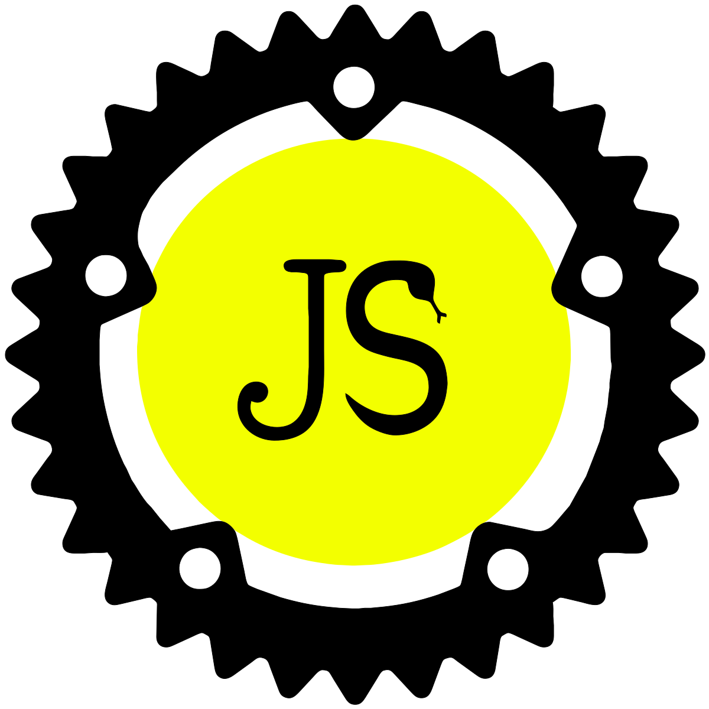
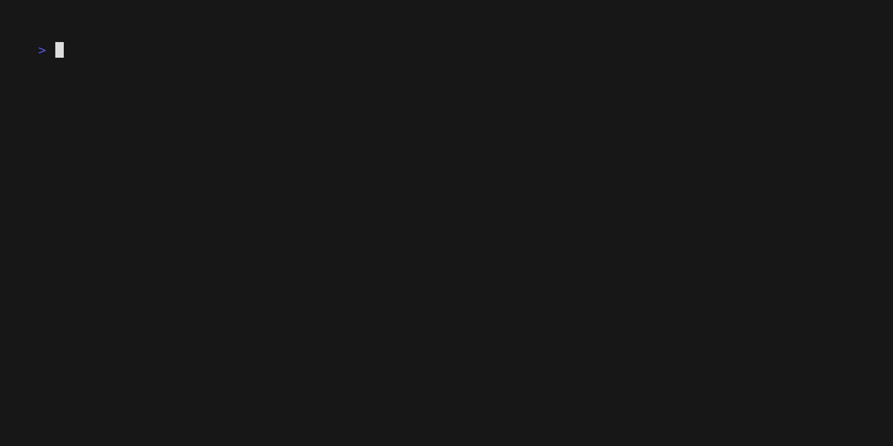

# Boa

<p align="center">
    
</p>

This is an experimental Javascript lexer, parser and interpreter written in Rust.
Currently, it has support for some of the language.

[![Build Status][build_badge]][build_link]
[](https://codecov.io/gh/boa-dev/boa)
[](https://crates.io/crates/Boa)
[](https://docs.rs/Boa/)
[](https://discord.gg/tUFFk9Y)

[build_badge]: https://github.com/boa-dev/boa/actions/workflows/rust.yml/badge.svg?event=push&branch=main
[build_link]: https://github.com/boa-dev/boa/actions/workflows/rust.yml?query=event%3Apush+branch%3Amain

## Live Demo (WASM)

<https://boa-dev.github.io/boa/playground/>

You can get more verbose errors when running from the command line.

## Development documentation

You can check the internal development docs at <https://boa-dev.github.io/boa/doc>.

## Conformance

To know how much of the _ECMAScript_ specification does Boa cover, you can check out results running the _ECMASCript Test262_ test suite [here](https://boa-dev.github.io/boa/test262/).

## Contributing

Please, check the [CONTRIBUTING.md](CONTRIBUTING.md) file to know how to
contribute in the project. You will need Rust installed and an editor. We have
some configurations ready for VSCode.

### Debugging

Check [debugging.md](./docs/debugging.md) for more info on debugging.

### Web Assembly

This interpreter can be exposed to JavaScript!
You can build the example locally with:

```shell
npm run build
```

In the console you can use `window.evaluate` to pass JavaScript in.
To develop on the web assembly side you can run:

```shell
npm run serve
```

then go to `http://localhost:8080`.

## Usage

- Clone this repo.
- Run with `cargo run -- test.js` where `test.js` is an existing JS file with any JS valid code.
- If any JS doesn't work then it's a bug. Please raise an [issue](https://github.com/boa-dev/boa/issues/)!

### Example



## Command-line Options

```shell
USAGE:
    boa [OPTIONS] [FILE]...

FLAGS:
    -h, --help       Prints help information
    -V, --version    Prints version information

OPTIONS:
    -a, --dump-ast <FORMAT>       Dump the abstract syntax tree (ast) to stdout with the given format [possible values: Debug, Json,
                                  JsonPretty]

ARGS:
    <FILE>...    The JavaScript file(s) to be evaluated
```

## Roadmap

See [Milestones](https://github.com/boa-dev/boa/milestones).

## Benchmarks

See [Benchmarks](https://boa-dev.github.io/boa/dev/bench/).

## Profiling

See [Profiling](./docs/profiling.md).

## Changelog

See [CHANGELOG.md](./CHANGELOG.md).

## Communication

Feel free to contact us on [Discord](https://discord.gg/tUFFk9Y).

## License

This project is licensed under the [Unlicense](./LICENSE-UNLICENSE) or [MIT](./LICENSE-MIT) licenses, at your option.
