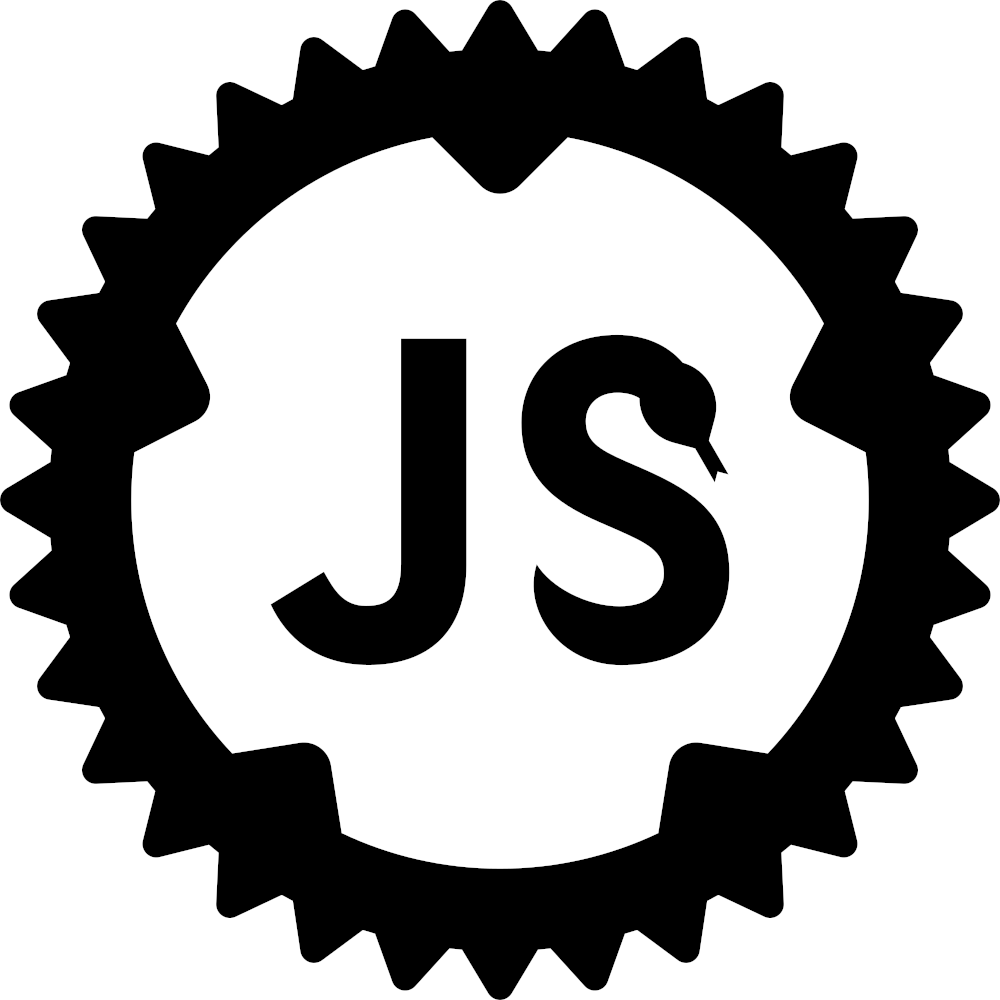

# Boa

<p align="center">
  <a href="https://boajs.dev/">
    <picture>
      <source media="(prefers-color-scheme: dark)" srcset="./assets/logo_yellow.svg">
      <source media="(prefers-color-scheme: light)" srcset="./assets/logo_black.svg">
      
    </picture>
    </a>
</p>

This is an experimental Javascript lexer, parser and interpreter written in Rust.
Currently, it has support for some of the language.

[![Build Status][build_badge]][build_link]
[](https://codecov.io/gh/boa-dev/boa)
[](https://crates.io/crates/boa_engine)
[](https://docs.rs/boa_engine)
[](https://discord.gg/tUFFk9Y)
[](https://matrix.to/#/#boa:matrix.org)

[build_badge]: https://github.com/boa-dev/boa/actions/workflows/rust.yml/badge.svg?event=push&branch=main
[build_link]: https://github.com/boa-dev/boa/actions/workflows/rust.yml?query=event%3Apush+branch%3Amain

## Live Demo (WASM)

Try out the engine now at the live WASM playground [here](https://boajs.dev/playground)!

Prefer a CLI? Feel free to try out `boa_cli`!

## Boa Crates

Boa currently publishes and actively maintains the following crates:

- **`boa_ast`** - Boa's ECMAScript Abstract Syntax Tree
- **`boa_cli`** - Boa's CLI && REPL implementation
- **`boa_engine`** - Boa's implementation of ECMAScript builtin objects and
  execution
- **`boa_gc`** - Boa's garbage collector
- **`boa_interner`** - Boa's string interner
- **`boa_parser`** - Boa's lexer and parser
- **`boa_profiler`** - Boa's code profiler
- **`boa_icu_provider`** - Boa's ICU4X data provider
- **`boa_runtime`** - Boa's WebAPI features
- **`boa_string`** - Boa's ECMAScript string implementation.

Please note: the `Boa` and `boa_unicode` crates are deprecated.

## Boa Engine Example

To use `Boa` simply follow the below.

Add the below dependency to your `Cargo.toml`:

```toml
[dependencies]
boa_engine = "0.20.0"
```

Then in `main.rs`, copy the below:

```rust
use boa_engine::{Context, Source, JsResult};

fn main() -> JsResult<()> {
  let js_code = r#"
      let two = 1 + 1;
      let definitely_not_four = two + "2";

      definitely_not_four
  "#;

  // Instantiate the execution context
  let mut context = Context::default();

  // Parse the source code
  let result = context.eval(Source::from_bytes(js_code))?;

  println!("{}", result.display());

  Ok(())
}

```

Now, all that's left to do is `cargo run`.

Congrats! You've executed your first `JavaScript` using `Boa`!

## Documentation

For more information on `Boa`'s API. Feel free to check out our documentation.

[**API Documentation**](https://docs.rs/boa_engine/latest/boa_engine/)

## Conformance

To know how much of the _ECMAScript_ specification does Boa cover, you can check out results
running the _ECMASCript Test262_ test suite [here](https://boajs.dev/conformance).

## Contributing

Please, check the [CONTRIBUTING.md](CONTRIBUTING.md) file to know how to
contribute in the project. You will need Rust installed and an editor. We have
some configurations ready for VSCode.

### Debugging

Check [debugging.md](./docs/debugging.md) for more info on debugging.

### Web Assembly

> [!IMPORTANT]
>
> This only applies to `wasm32-unknown-unknown` target,
> `WASI` and `Emscripten` target variants are handled automatically.

- Enable the `js` feature flag.
- Set `RUSTFLAGS='--cfg getrandom_backend="wasm_js"'`

The `rustflags` can also be set by adding a `.cargo/config.toml` file in the project root directory:

```toml
[target.wasm32-unknown-unknown]
rustflags = '--cfg getrandom_backend="wasm_js"'
```

For more information see: [`getrandom` WebAssembly Support][getrandom-webassembly-support]

[getrandom-webassembly-support]: https://docs.rs/getrandom/latest/getrandom/index.html#webassembly-support

## Usage

- Clone this repo.
- Run with `cargo run -- test.js` in the project root directory where `test.js` is a path to an existing JS file with any valid JS code.
- If any JS doesn't work then it's a bug. Please raise an [issue](https://github.com/boa-dev/boa/issues/)!

### Example


## Command-line Options

```txt
Usage: boa [OPTIONS] [FILE]...

Arguments:
  [FILE]...  The JavaScript file(s) to be evaluated

Options:
      --strict                        Run in strict mode
  -a, --dump-ast [<FORMAT>]           Dump the AST to stdout with the given format [possible values: debug, json, json-pretty]
  -t, --trace                         Dump the AST to stdout with the given format
      --vi                            Use vi mode in the REPL
  -O, --optimize                      
      --optimizer-statistics          
      --flowgraph [<FORMAT>]          Generate instruction flowgraph. Default is Graphviz [possible values: graphviz, mermaid]
      --flowgraph-direction <FORMAT>  Specifies the direction of the flowgraph. Default is top-top-bottom [possible values: top-to-bottom, bottom-to-top, left-to-right, right-to-left]
      --debug-object                  Inject debugging object `$boa`
  -m, --module                        Treats the input files as modules
  -r, --root <ROOT>                   Root path from where the module resolver will try to load the modules [default: .]
  -h, --help                          Print help (see more with '--help')
  -V, --version                       Print version
```

## Roadmap

See [Milestones](https://github.com/boa-dev/boa/milestones).

## Benchmarks

The current benchmarks are taken from v8's benchmark, you can find [here][boa-benchmarks], You can also view the results of nightly benchmark runs comparing Boa with other JavaScript engines [here](https://boajs.dev/benchmarks).

If you wish to run the benchmarks locally, then run boa in release using the `combined.js` which contains all the sub-benchmarks in the `bench-v8` directory.

```bash
cargo run --release -p boa_cli -- bench-v8/combined.js
```

> [!TIP]
>
> If you'd like to run only a subset of the benchmarks, you can modify the `Makefile` located in the [`bench-v8` directory][boa-benchmarks].
> Comment out the benchmarks you don't want to include, then run `make`. After that, you can run Boa using the same command as above.

[boa-benchmarks]: https://github.com/boa-dev/data/tree/benchmarks/bench

## Profiling

See [Profiling](./docs/profiling.md).

## Changelog

See [CHANGELOG.md](./CHANGELOG.md).

## Communication

Feel free to contact us on [Matrix](https://matrix.to/#/#boa:matrix.org) if you have any questions.
Contributor discussions take place on the same Matrix Space if you're interested in contributing.
We also have a [Discord](https://discord.gg/tUFFk9Y) for any questions or issues.

## License

This project is licensed under the [Unlicense](./LICENSE-UNLICENSE) or [MIT](./LICENSE-MIT) licenses, at your option.
