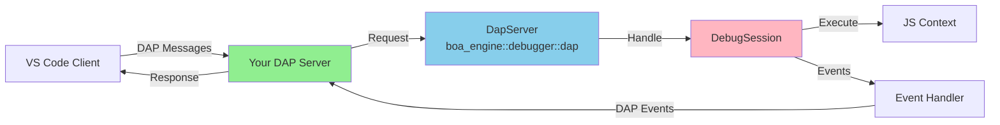
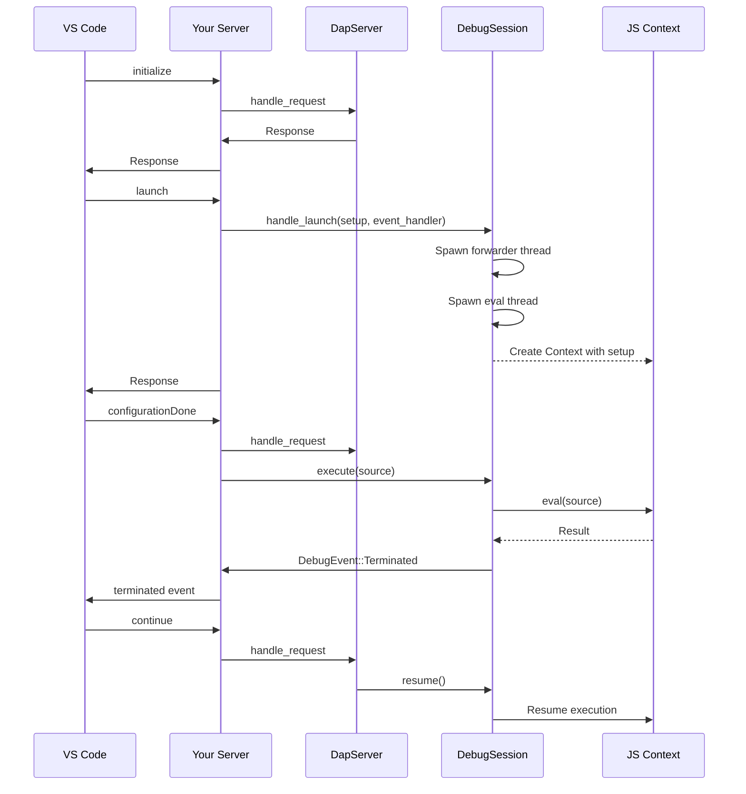

# Boa Debugger - Quick Start Guide

**Building a Debug Adapter Protocol (DAP) Server with Boa's Debugger API**

This guide shows how to build a DAP server that integrates VS Code (or other DAP clients) with Boa's JavaScript execution engine.

## Architecture Overview



**Your Responsibilities:**
1. Transport layer (TCP/stdio) - read/write DAP protocol messages
2. Event forwarding - convert `DebugEvent` → DAP protocol events
3. Context setup - register console, runtimes, etc.

**Boa Provides:**
- `DapServer` - handles DAP protocol messages
- `DebugSession` - manages execution and state
- `Debugger` - core debugging functionality

## 30-Second Setup (Pause/Resume)

If you just want to experiment with pause/resume without DAP:

```rust
use boa_engine::{Context, Source};
use boa_engine::debugger::{Debugger, DebuggerHostHooks};
use std::sync::{Arc, Mutex, Condvar};
use std::thread;
use std::time::Duration;

// 1. Create debugger
let debugger = Arc::new(Mutex::new(Debugger::new()));
let condvar = Arc::new(Condvar::new());

// 2. Integrate with VM
let hooks = DebuggerHostHooks::new(debugger.clone(), condvar.clone());
let mut context = Context::builder()
    .host_hooks(Box::new(hooks))
    .build().unwrap();

// 3. Control from external thread
let control_debugger = debugger.clone();
let control_condvar = condvar.clone();
thread::spawn(move || {
    thread::sleep(Duration::from_millis(100));
    control_debugger.lock().unwrap().pause();
    
    thread::sleep(Duration::from_secs(1));
    control_debugger.lock().unwrap().resume();
    control_condvar.notify_all();
});

// 4. Run code
context.eval(Source::from_bytes("console.log('test')")).unwrap();
```

## Basic DAP Server Implementation

```rust
use boa_engine::{Context, JsResult, debugger::{
    Debugger, dap::{DapServer, DebugEvent, ProtocolMessage, messages::*},
}};
use std::sync::{Arc, Mutex};
use std::io::{self, Write, BufRead, BufReader};
use std::net::TcpListener;

fn main() -> io::Result<()> {
    // 1. Listen for DAP client connections
    let listener = TcpListener::bind("127.0.0.1:4711")?;
    eprintln!("[DAP] Listening on port 4711");
    
    let (stream, _) = listener.accept()?;
    eprintln!("[DAP] Client connected");
    
    // 2. Create debugger infrastructure
    let debugger = Arc::new(Mutex::new(Debugger::new()));
    let session = Arc::new(Mutex::new(DebugSession::new(debugger.clone())));
    let mut dap_server = DapServer::new(session.clone());
    
    // 3. Set up I/O
    let mut reader = BufReader::new(stream.try_clone()?);
    let mut writer = stream;
    
    // 4. Message loop
    loop {
        // Read DAP message
        let message = read_dap_message(&mut reader)?;
        
        match message {
            ProtocolMessage::Request(request) => {
                // Special handling for launch
                if request.command == "launch" {
                    handle_launch(&request, &session, &mut writer)?;
                    continue;
                }
                
                // Let DapServer handle all other requests
                let responses = dap_server.handle_request(request);
                
                // Send responses
                for response in responses {
                    send_dap_message(&response, &mut writer)?;
                }
            }
            _ => eprintln!("[DAP] Unexpected message type"),
        }
    }
}
```

## Handling Launch Request

The launch request needs special handling to:
1. Set up the JavaScript context with runtimes
2. Register an event handler
3. Execute the program

```rust
fn handle_launch<W: Write + Send + 'static>(
    request: &Request,
    session: &Arc<Mutex<DebugSession>>,
    writer: &mut W,
) -> io::Result<()> {
    // Parse launch arguments
    let args: LaunchRequestArguments = 
        serde_json::from_value(request.arguments.clone().unwrap()).unwrap();
    
    // 1. Create context setup function
    let context_setup = Box::new(|context: &mut Context| -> JsResult<()> {
        // Register console, modules, etc.
        boa_runtime::Console::init(context);
        Ok(())
    });
    
    // 2. Create event handler to forward events to client
    let writer_clone = /* clone writer */;
    let event_handler = Box::new(move |event: DebugEvent| {
        match event {
            DebugEvent::Stopped { reason, description } => {
                // Send DAP "stopped" event
                let stopped_event = Event {
                    seq: 0,
                    event: "stopped".to_string(),
                    body: Some(serde_json::to_value(StoppedEventBody {
                        reason,
                        description,
                        thread_id: Some(1),
                        all_threads_stopped: true,
                        ..Default::default()
                    }).unwrap()),
                };
                send_event(&stopped_event, &writer_clone);
            }
            DebugEvent::Terminated => {
                // Send DAP "terminated" event
                let terminated = Event {
                    seq: 0,
                    event: "terminated".to_string(),
                    body: None,
                };
                send_event(&terminated, &writer_clone);
            }
            _ => {}
        }
    });
    
    // 3. Call handle_launch - spawns forwarder thread and execution thread
    session.lock().unwrap()
        .handle_launch(args, context_setup, event_handler)
        .map_err(|e| io::Error::new(io::ErrorKind::Other, e))?;
    
    // 4. Send success response
    let response = Response {
        seq: 0,
        request_seq: request.seq,
        success: true,
        command: request.command.clone(),
        message: None,
        body: None,
    };
    send_dap_message(&ProtocolMessage::Response(response), writer)?;
    
    Ok(())
}
```

## DAP Protocol Message Handling

```rust
fn read_dap_message<R: BufRead>(reader: &mut R) -> io::Result<ProtocolMessage> {
    // Read "Content-Length: N\r\n"
    let mut header = String::new();
    reader.read_line(&mut header)?;
    
    let content_length: usize = header
        .trim()
        .strip_prefix("Content-Length: ")
        .and_then(|s| s.parse().ok())
        .ok_or_else(|| io::Error::new(io::ErrorKind::InvalidData, "Invalid header"))?;
    
    // Read "\r\n"
    let mut empty = String::new();
    reader.read_line(&mut empty)?;
    
    // Read message body
    let mut buffer = vec![0u8; content_length];
    reader.read_exact(&mut buffer)?;
    
    // Parse JSON
    serde_json::from_slice(&buffer)
        .map_err(|e| io::Error::new(io::ErrorKind::InvalidData, e))
}

fn send_dap_message<W: Write>(
    message: &ProtocolMessage,
    writer: &mut W,
) -> io::Result<()> {
    let json = serde_json::to_string(message)?;
    write!(writer, "Content-Length: {}\r\n\r\n{}", json.len(), json)?;
    writer.flush()?;
    Ok(())
}
```

## Execution Flow



## Complete Minimal Example

```rust
use boa_engine::{Context, Source, JsResult};
use boa_engine::debugger::{
    Debugger,
    dap::{DapServer, DebugEvent, ProtocolMessage, Request, Response, Event},
    session::DebugSession,
};
use std::sync::{Arc, Mutex};
use std::io::{BufRead, BufReader, Write};

fn main() -> std::io::Result<()> {
    let listener = std::net::TcpListener::bind("127.0.0.1:4711")?;
    let (stream, _) = listener.accept()?;
    
    let debugger = Arc::new(Mutex::new(Debugger::new()));
    let session = Arc::new(Mutex::new(DebugSession::new(debugger)));
    let mut dap_server = DapServer::new(session.clone());
    
    let mut reader = BufReader::new(stream.try_clone()?);
    let writer = Arc::new(Mutex::new(stream));
    
    loop {
        let msg = read_message(&mut reader)?;
        
        if let ProtocolMessage::Request(req) = msg {
            if req.command == "terminate" {
                send_response(&req, true, &writer)?;
                break;
            }
            
            let responses = dap_server.handle_request(req);
            for resp in responses {
                send_message(&resp, &writer)?;
            }
        }
    }
    
    Ok(())
}

// Helper functions omitted for brevity
// See full implementation in cli/src/debug/dap.rs
```

## Key Integration Points

### 1. Context Setup (Runtimes)

### 1. Context Setup (Runtimes)

```rust
// Called by DebugSession when creating the Context
let context_setup = Box::new(|context: &mut Context| -> JsResult<()> {
    // Register built-in runtime modules
    boa_runtime::Console::init(context);
    
    // Add custom globals, modules, etc.
    context.register_global_property(
        "myGlobal",
        42,
        Attribute::all(),
    )?;
    
    Ok(())
});
```

### 2. Event Handling (Forward to Client)

```rust
let event_handler = Box::new(move |event: DebugEvent| {
    match event {
        DebugEvent::Stopped { reason, description } => {
            // Convert to DAP protocol and send to client
            eprintln!("[DAP] Execution stopped: {}", reason);
        }
        DebugEvent::Terminated => {
            eprintln!("[DAP] Program terminated");
        }
        DebugEvent::Shutdown => {
            eprintln!("[DAP] Debugger shutdown");
        }
    }
});
```

### 3. Program Execution

```rust
// Read JavaScript file
let source = std::fs::read_to_string(program_path)?;

// Execute in the debug session
let session = session.lock().unwrap();
match session.execute(source) {
    Ok(result) => eprintln!("[DAP] Execution completed: {:?}", result),
    Err(error) => eprintln!("[DAP] Execution error: {:?}", error),
}
```

## DAP Commands Handled by DapServer

The `DapServer` automatically handles these commands:

| Command | Description | Implementation |
|---------|-------------|----------------|
| `initialize` | Initialize debug adapter | ✅ Returns capabilities |
| `configurationDone` | Configuration complete | ✅ Ready signal |
| `threads` | List execution threads | ✅ Returns thread 1 |
| `continue` | Resume execution | ⚠️ Calls debugger.resume() |
| `pause` | Pause execution | ⚠️ Calls debugger.pause() |
| `disconnect` | End debug session | ✅ Cleanup |
| `setBreakpoints` | Set breakpoints | ❌ Not functional yet |
| `stackTrace` | Get call stack | ❌ Not functional yet |
| `scopes` | Get variable scopes | ❌ Not functional yet |
| `variables` | Get variable values | ❌ Not functional yet |

**Note**: ✅ = Working, ⚠️ = API works but no VM integration, ❌ = Not implemented

## Current Limitations

The debugger infrastructure is in place but VM integration is incomplete:

- ❌ **Breakpoints**: Can be set but not checked during execution
- ❌ **Stepping**: API exists but VM doesn't honor step commands
- ❌ **Stack inspection**: No frame introspection yet
- ❌ **Variable inspection**: No environment access yet
- ⚠️ **Pause/Resume**: Infrastructure works but needs VM hook integration

## Testing Your DAP Server

### Start the server:
```bash
cargo run --package boa_cli -- --dap --tcp 4711
```

### Test with VS Code:

`.vscode/launch.json`:
```json
{
  "version": "0.2.0",
  "configurations": [{
    "type": "boa",
    "request": "launch",
    "name": "Debug JS",
    "program": "${file}",
    "debugServer": 4711
  }]
}
```

### Test with netcat:
```bash
# Send initialize request
echo -e 'Content-Length: 123\r\n\r\n{"seq":1,"type":"request","command":"initialize","arguments":{}}' | nc localhost 4711
```

## Real-World Implementation

See complete working implementation:
- 📄 **cli/src/debug/dap.rs** - Full TCP server with console integration
- 📄 **core/engine/src/debugger/dap/server.rs** - DapServer implementation  
- 📄 **core/engine/src/debugger/dap/session.rs** - DebugSession management

## API Reference

```rust
// Create debugger
let debugger = Arc::new(Mutex::new(Debugger::new()));

// Create session
let session = Arc::new(Mutex::new(DebugSession::new(debugger)));

// Create server
let mut dap_server = DapServer::new(session.clone());

// Handle requests
let responses = dap_server.handle_request(request);

// Launch with setup
session.lock().unwrap().handle_launch(
    launch_args,      // LaunchRequestArguments
    context_setup,    // Box<dyn FnOnce(&mut Context) -> JsResult<()>>
    event_handler,    // Box<dyn Fn(DebugEvent) + Send>
)?;

// Execute JavaScript
session.lock().unwrap().execute(source_code)?;
```

## Next Steps

1. **Build your transport layer** - TCP or stdio
2. **Implement event forwarding** - Convert DebugEvent to DAP events
3. **Set up context** - Register console and runtimes
4. **Test with VS Code** - Use the DAP client

For detailed architecture and design philosophy, see **README.MD**.

---

**Status**: DAP infrastructure complete, VM integration in progress  
**Last Updated**: January 2026
