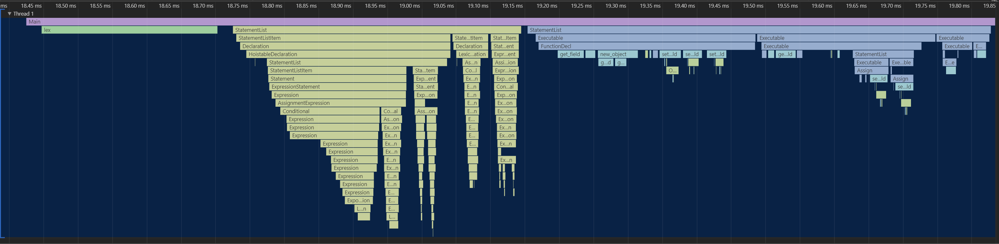

# Profiling



It's possible to get a full profile of Boa in action.  
Sometimes this is needed to figure out where it is spending most of it's time.

We use a crate called [measureme](https://github.com/rust-lang/measureme), which helps us keep track of timing functions during runtime.

When the "profiler" flag is enabled, you compile with the profiler and it is called throughout the interpreter.  
when the feature flag is not enabled, you have an empty dummy implementation that is just no ops. rustc should completely optimize that away. So there should be no performance downgrade from these changes

## Prerequisites

- [Crox](https://github.com/rust-lang/measureme/blob/master/crox/README.md)
- [summarize (Optional)](https://github.com/rust-lang/measureme/blob/master/summarize/README.md)

## How To Use

You can run boa using the "profiler" feature flag to enable profiling. Seeing as you'll most likely be using boa_cli you can pass this through, like so:

`cargo run --release --features Boa/profiler ../tests/js/test.js`

Once finished you should see some trace files left in the directory (boa_cli in this case).  
In the same directory as the `.events, string_data, string_index` files run `crox my_trace` or whatever the name of the files are. This will generate a chrome_profiler.json file, you can load this into Chrome Dev tools.

### Summarize

If you just want a summary of what functions were ran the most or where the most time was spent you can run `summarize`.  
This is the same as above except instead of calling `$ crox my_trace` you call `$ summarize summarize my_trace`. This will generate something like below:

```
+---------------------------------------+-----------+-----------------+----------+------------+
| Item                                  | Self time | % of total time | Time     | Item count |
+---------------------------------------+-----------+-----------------+----------+------------+
| From<Object>                          | 1.04ms    | 14.776          | 1.04ms   | 146        |
+---------------------------------------+-----------+-----------------+----------+------------+
| new_object                            | 356.50µs  | 5.082           | 533.50µs | 18         |
+---------------------------------------+-----------+-----------------+----------+------------+
| create_instrinsics                    | 263.50µs  | 3.756           | 6.38ms   | 1          |
+---------------------------------------+-----------+-----------------+----------+------------+
| make_builtin_fn: toString             | 218.50µs  | 3.114           | 290.50µs | 12         |
+---------------------------------------+-----------+-----------------+----------+------------+
| Value::get_field                      | 178.60µs  | 2.546           | 340.20µs | 60         |
+---------------------------------------+-----------+-----------------+----------+------------+
| Value::get_property                   | 161.60µs  | 2.303           | 161.60µs | 60         |
+---------------------------------------+-----------+-----------------+----------+------------+
| lex                                   | 135.60µs  | 1.933           | 135.60µs | 1          |
+---------------------------------------+-----------+-----------------+----------+------------+
| math:create                           | 125.40µs  | 1.787           | 1.11ms   | 1          |
+---------------------------------------+-----------+-----------------+----------+------------+
| Value::set_field                      | 100.20µs  | 1.428           | 262.80µs | 8          |
+---------------------------------------+-----------+-----------------+----------+------------+
| function::builtin                     | 82.40µs   | 1.175           | 82.40µs  | 146        |
+---------------------------------------+-----------+-----------------+----------+------------+
| String                                | 81.60µs   | 1.163           | 961.60µs | 1          |
+---------------------------------------+-----------+-----------------+----------+------------+
```

## More Info

- https://blog.rust-lang.org/inside-rust/2020/02/25/intro-rustc-self-profile.html
- https://github.com/rust-lang/measureme
- https://github.com/rust-lang/measureme/blob/master/crox/README.md
