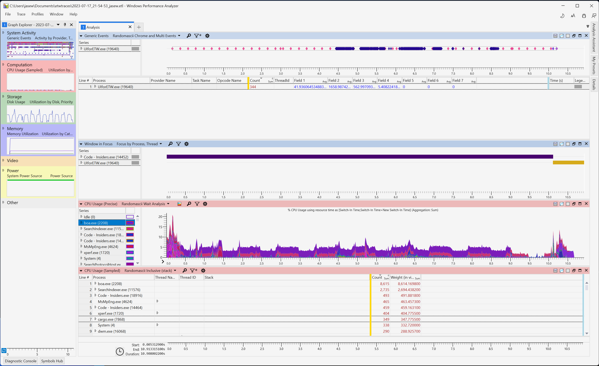
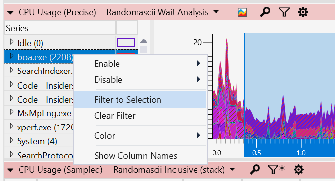
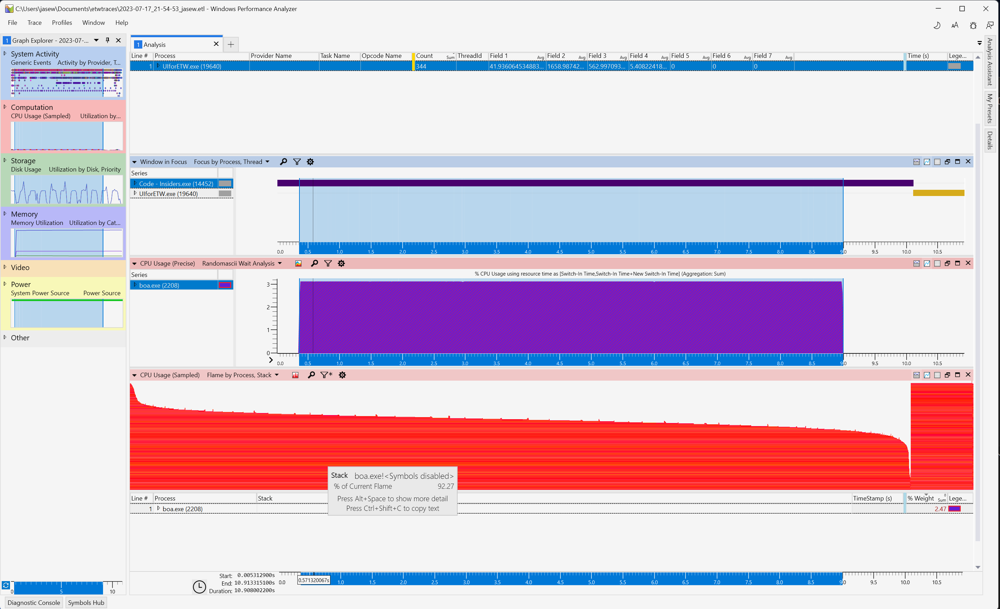
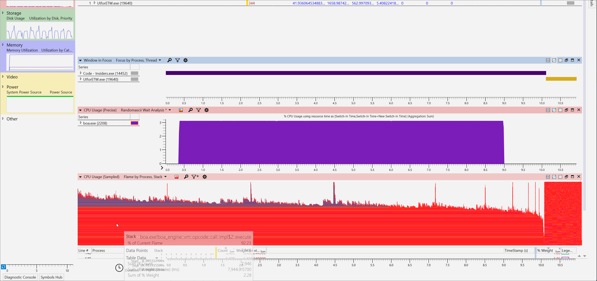

# Profiling Boa With Windows Performance Analyzer

Windows has a performance analyzing tool that creates graphs and data tables of Event Tracing for Windows (ETW) events. You can analyze your whole system but also individual binaries too.
This can be used for performance tracing with Rust programs like Boa.

For this to work you will need to have your code running in native windows and not WSL.

- First off, install [UI For ETW](https://github.com/google/UIforETW). You can grab the latest version from the releases page.
- Then install Windows Performance Toolkit, you can grab it from [here](https://learn.microsoft.com/en-us/windows-hardware/get-started/adk-install)
- [Optional] - Follow [Improved Symbol Setup](#improved-symbol-setup) to improve symbol loading. So that its ready once you open up WPA. This points WPA to your pdb files inside your target directory so you can see the function names instead of just addresses.
- Open up `UI for ETW`, click on the `Start Tracing` button and then run Boa in dev mode (hopefully a script long enough for it to record something meaningful).
- When the program has finished running, click `Save Trace Buffers` to create the trace.
- Right click on the your newly created trace and open it with WPA

You should have something like this:

This is broken up into 4 sections:
- **Generic Events** (Keyboard, mouse, user-input events), these can be useful to help track when something happened.
- **Windows In Focus** (What windows were in focus at the time)
- **CPU Usage (Sampled)** Periodically sampling the CPU usage at predefined intervals. We will be using this view mainly
- **CPU Usage (Precise)** Offers more detailed and accurate information about CPU usage by using precise event-based tracing. By default Wait Analysis is enabled, which is useful for debugging deadlocks and other issues. However we will not be using this view.

Windows Performance Analyzer is analzying everything on your system (which is useful in cases where we may not anticipate outside factors affecting our program).

However we only care about the boa process, so we should filter out everything else. We can do this by right clicking boa.exe and filtering down to just this.

Once completed, navigate to the `CPU Usage (Sampled)` section underneath and click the `Display Graph and Table` header icon, which is the first symbol in the upper right hand corner.

Then on the dropdown (same tab) select `Flame By Process, Stack`. If followed correctly you should have something which looks like this:

Almost there..
Symbols are not showing, WPA doesn't scan symbols by default. You need to click Trace at the top and then `Load Symbols`.

## Improved Symbol Setup
You can use an environment variable to tell WPA where your symbols live: I have set: `_NT_SYMBOL_PATH=SRV*C:\symbols*https://msdl.microsoft.com/download/symbols;C:\Users\[you]\[workspace]\boa\target\debug` instead which WPA should pick up automatically.

You can read more about `_NT_SYMBOL_PATH` [here](https://docs.microsoft.com/en-us/windows-hardware/drivers/debugger/symbol-path).

