# Shapes (Hidden Classes)

The best way to explain object shapes is through examples. It all begins with the root shape.

```mermaid
flowchart LR
    classDef New style id2 fill:#bbf,stroke:#f66,stroke-width:2px,color:#fff,stroke-dasharray: 5 5
    style Root stroke:#000,stroke-width:5px
    style PropertyTable fill:#071E22

    Root(<b>Root Shape</b>\n<b>Prototype:</i> <i>None</i>) -->| Property Count 0 | PropertyTable(PropertyTable\n)
```



The root shape is where the transition chain starts from, it has a pointer to a `PropertyTable`,
we will explain what it is and does later on!

**NOTE:** We will annotate the shapes with `S` followed by a number.

If we have an example of JavaScript code like:

```js
let o = {};
```

The following chain is created:

```mermaid
flowchart LR
    classDef New style id2 fill:#bbf,stroke:#f66,stroke-width:2px,color:#fff,stroke-dasharray: 5 5
    style Root stroke:#000,stroke-width:5px
    style PropertyTable fill:#071E22

    Root(<b>S0: Root Shape</b>\n<b>Prototype:</b> <i>None</i>) -->|Property Count: 0| PropertyTable(PropertyTable\n)

    ObjectPrototype(<b>S1: Prototype Shape</b>\n<b>Prototype:</b> Object.prototype) -->|Property Count: 0|PropertyTable
    ObjectPrototype:::New -->|Previous| Root
```



We transition, the object `o` has `S1` shape. The root shape does not have a prototype. So we transition into a shape that has the
`Object.prototype` as `__proto__`. We can see that the shapes inherited the `PropertyTable` from the `root`.

Ok, Let us add a property `x`:

```js
o.x = 100; // The value is not important!
```

Then this happens:

```mermaid
flowchart LR
    classDef New style id2 fill:#bbf,stroke:#f66,stroke-width:2px,color:#fff,stroke-dasharray: 5 5
    style Root stroke:#000,stroke-width:5px
    style PropertyTable fill:#071E22

    Root(<b>S0: Root Shape</b>\nPrototype: <i>None</i>) -->|Property Count: 0| PropertyTable(<b>PropertyTable</b>\nx: Slot 0, writable, configurable, enumerable)

    ObjectPrototype(<b>S1: Prototype Shape</b>\n<b>Prototype:</b> <i>Object.prototype</i>) -->|Property Count: 0|PropertyTable
    ObjectPrototype -->|Previous| Root

    InsertX(<b>S2: Insert Shape</b>\n<b>Property:</b> '<i>x</i>') --> |Property Count: 1|PropertyTable
    InsertX:::New -->|Previous| ObjectPrototype
```



The object `o` has shape `S2` shape now, we can see that it also inherited the `PropertyTable`, but it's property count is `1` and
an entry has been added into the `PropertyTable`.

We can see that the property added is `writable`, `configurable`, and `enumerable`, but we also see `Slot 0`,
this is the index into the dense storage in the object itself.

Here is how it would look with the `o` object:

```mermaid
flowchart LR
    classDef New style id2 fill:#bbf,stroke:#f66,stroke-width:2px,color:#fff,stroke-dasharray: 5 5
    style Root stroke:#000,stroke-width:5px
    style PropertyTable fill:#071E22

    Root(<b>S0: Root Shape</b>\n<b>Prototype:</b> <i>None</i>) -->| Property Count: 0 | PropertyTable(<b>PropertyTable</b>\nx: Slot 0, writable, configurable, enumerable)

    ObjectPrototype(<b>S1: Prototype Shape</b>\n<b>Prototype:</b> <i>Object.prototype</i>) -->| Property Count: 0 |PropertyTable
    ObjectPrototype -->|Previous| Root

    InsertX(<b>S2: Insert Shape</b>\n<b>Property:</b> '<i>x</i>') --> | Property Count: 1 | PropertyTable
    InsertX -->|Previous| ObjectPrototype

    O(<b>Object o</b>\n<b>Element 0:</b> JsValue: <i>100</i>)
    O:::New --> InsertX
```



Let's define a getter and setter `y`

```js
// What the getter/setter are not important!
Object.defineProperty(o, "y", {
  enumerable: true,
  configurable: true,
  get: function () {
    return this.x;
  },
  set: function (value) {
    this.x = value;
  },
});
```



```mermaid
flowchart LR
    classDef New style id2 fill:#bbf,stroke:#f66,stroke-width:2px,color:#fff,stroke-dasharray: 5 5
    style Root stroke:#000,stroke-width:5px
    style PropertyTable fill:#071E22

    Root(<b>S0: Root Shape</b>\n<b>Prototype:</b> <i>None</i>) -->|Property Count: 0| PropertyTable(<b>PropertyTable</b>\nx: Slot 0, writable, configurable, enumerable\ny: Slot 1, has_get, has_set, configurable, enumerable)

    ObjectPrototype(<b>S1: Prototype Shape</b>\n<b>Prototype:</b> <i>Object.prototype</i>) -->| Property Count: 0 |PropertyTable
    ObjectPrototype -->|Previous| Root

    InsertX(<b>S2: Insert Shape</b>\n<b>Property:</b> '<i>x</i>') --> |Property Count: 1| PropertyTable
    InsertX -->|Previous| ObjectPrototype

    InsertY(<b>S3: Insert Shape</b>\n<b>Property:</b> '<i>y</i>') --> |Property Count: 2| PropertyTable
    InsertY:::New -->|Previous| InsertX

    O(<b>Object o\nElement 0:</b> JsValue: 100\n<b>Element 1:</b> JsValue: func\n<b>Element 2:</b> JsValue: func) --> InsertY
```

We can see that the property has been added into the property table, it has the `has_get` and `has_set` flags set,
in the object there are two elements added, the first is the `get` function and the second is the `set` function.

Slots are varying in length, two for accessor properties and one for data properties, the index points to the first
value in the object storage.

What would happen if an object had `S2` shape and we tried to access a property `y` how does it know if it
has or doesn't have a property named `y`? By the property count on the shape, it has property count `1`,
all the object in the `PropertyTable` are stored in a map that preserves the order and and can be indexed.

When we do a lookup the on property table, if the index of the property is greater than the property count (`1`),
than it does not belong to the shape.

Now, Let's create a new object `o2`, with property `x`:

```js
let o2 = { x: 200 };
```

After this `o2` would have the `S2` shape.

How does the shape know that it can reuse `S1` then to go to `S2`? This is not the real structure!
Every shape has pointers to forward transitions that happened, these are weak pointers so we don't keep
alive unused shapes. The pointers have been omitted, so the diagrams are clearer (too many arrows).

Ok, now let us define a property `z` instead of `y`:

```js
o2.z = 300;
```

The following changes accure to the shape tree:

```mermaid
flowchart LR
    classDef New style id2 fill:#bbf,stroke:#f66,stroke-width:2px,color:#fff,stroke-dasharray: 5 5
    style Root stroke:#000,stroke-width:5px
    style PropertyTable fill:#071E22
    style PropertyTableFork fill:#071E22

    Root(<b>S0: Root Shape</b>\n<b>Prototype:</b> <i>None</i>) -->| Property Count: 0 | PropertyTable(<b>PropertyTable</b>\nx: Slot 0, writable, configurable, enumerable\ny: Slot 1, has_get, has_set, configurable, enumerable)

    ObjectPrototype(<b>S1: Prototype Shape\nPrototype:</b> <i>Object.prototype</i>) -->| Property Count: 0 |PropertyTable
    ObjectPrototype -->|Previous| Root

    InsertX(<b>S2: Insert Shape\nProperty:</b> '<i>x</i>') --> | Property Count: 1 | PropertyTable
    InsertX -->|Previous| ObjectPrototype

    InsertY(<b>S3: Insert Shape\nProperty:</b> '<i>y</i>') --> | Property Count: 2 | PropertyTable
    InsertY -->|Previous| InsertX

    PropertyTableFork(<b>PropertyTable</b>\nx: Slot 0, writable, configurable, enumerable\nz: Slot 1, writable, configurable, enumerable)
    InsertZ(<b>S4: Insert Shape\nProperty:</b> '<i>z</i>') --> | Property Count: 2 | PropertyTableFork:::New
    InsertZ:::New -->|Previous| InsertX

    O(<b>Object o\nElement 0:</b> JsValue: 100\n<b>Element 1:</b> JsValue: func\n<b>Element 2:</b> JsValue: func) --> InsertY
    O2(<b>Object o2\nElement 0:</b> JsValue: 200\n<b>Element 1:</b> JsValue: 300)
    O2:::New --> InsertZ
```



Now `o2` has `S4` shape. We can also see that `PropertyTable` has been forked, because we can no longer add a property at position `1`.

What would happen if we wanted to delete a property `x` from object `o`:

```js
delete o.x;
```



```mermaid
flowchart LR
    classDef New style id2 fill:#bbf,stroke:#f66,stroke-width:2px,color:#fff,stroke-dasharray: 5 5
    style Root stroke:#000,stroke-width:5px
    style PropertyTable fill:#071E22
    style PropertyTableFork fill:#071E22

    Root(<b>S0: Root Shape</b>\n<b>Prototype:</b> <i>None</i>) -->| Property Count: 0 | PropertyTable(<b>PropertyTable</b>\nx: Slot 0, writable, configurable, enumerable\ny: Slot 1, has_get, has_set, configurable, enumerable)

    ObjectPrototype(<b>S1: Prototype Shape\nPrototype:</b> <i>Object.prototype</i>) -->| Property Count: 0 |PropertyTable
    ObjectPrototype -->|Previous| Root


    PropertyTableFork(<b>PropertyTable</b>\ny: Slot 0, has_get, has_set, configurable, enumerable)
    InsertYNew(<b>S3: Insert Shape\nProperty:</b> <i>y</i>) --> | Property Count: 1 |PropertyTableFork:::New
    InsertYNew:::New -->|Previous| ObjectPrototype

    O(<b>Object o</b>\n<b>Element 0:</b> JsValue: func\n<b>Element 1:</b> JsValue: func) --> InsertYNew
    O:::New
```

**NOTE:**: `o2` and its shape have been omitted from the diagram.

When a deletion happens, we find the node in the chain where we added the property, and get it's parent (`base`),
we also remember that what transitions happened after the property insertion, then we apply them
one by one until we construct the chain and return the last shape in that chain.
