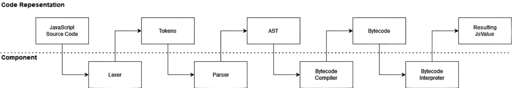

# VM

## Architecture



## Understanding the trace output

Once set up you can try some simple javascript in your test file. For example:

```js
let a = 1;
let b = 2;
```

Outputs:

```text
----------------------Compiled Output: '<main>'-----------------------
Location  Count    Handler    Opcode                     Operands

000000    0000      none      PushOne
000001    0001      none      PutLexicalValue            0000: 'a'
000006    0002      none      PushInt8                   2
000008    0003      none      PutLexicalValue            0001: 'b'
000013    0004      none      Return

Literals:
    <empty>

Bindings:
    0000: a
    0001: b

Functions:
    <empty>

Handlers:
    <empty>


----------------------------------------- Call Frame -----------------------------------------
Time          Opcode                     Operands                   Top Of Stack

6μs           PushOne                                               1
7μs           PutLexicalValue            0000: 'a'                  <empty>
0μs           PushInt8                   2                          2
1μs           PutLexicalValue            0001: 'b'                  <empty>
0μs           Return                                                <empty>

Stack:
    <empty>


undefined
```

The above output contains the following information:

- The bytecode and properties of the function that will be executed
  - `Compiled Output`: The bytecode.
    - `Location`: Location of the instruction (instructions are not the same size).
    - `Count`: Instruction count.
    - `Handler`: Exception handler, if the instruction throws an exception, which handler is responsible for that instruction and where it would jump. Additionally `>` denotes the beggining of a handler and `<` the end.
    - `Opcode`: Opcode name.
    - `Operands`: The operands of the opcode.
  - `Literals`: The literals used by the bytecode (like strings).
  - `Bindings`: Binding names used by the bytecode.
  - `Functions`: Function names use by the bytecode.
  - `Handlers`: Exception handlers use by the bytecode, it contains how many values should be on the stack and evironments (relative to `CallFrame`'s frame pointers).
- The code being executed (marked by `Vm Start` or `Call Frame`).
  - `Time`: The amount of time that instruction took to execute.
  - `Opcode`: Opcode name.
  - `Operands`: The operands of the opcode.
  - `Top Of Stack`: The top element of the stack **after** execution of instruction.
- `Stack`: The trace of the stack after execution ends.
- The result of the execution (The top element of the stack, if the stack is empty then `undefined` is returned).

### Comparing ByteCode output

If you wanted another engine's bytecode output for the same JS, SpiderMonkey's bytecode output is the best to use. You can follow the setup [here](https://udn.realityripple.com/docs/Mozilla/Projects/SpiderMonkey/Introduction_to_the_JavaScript_shell). You will need to build from source because the pre-built binarys don't include the debugging utilities which we need.

I named the binary `js_shell` as `js` conflicts with NodeJS. Once up and running you should be able to use `js_shell -f tests/js/test.js`. You will get no output to begin with, this is because you need to run `dis()` or `dis([func])` in the code. Once you've done that you should get some output like so:

```text
loc     op
-----   --
00000:  GlobalOrEvalDeclInstantiation 0 #
main:
00005:  One                             # 1
00006:  InitGLexical "a"                # 1
00011:  Pop                             #
00012:  Int8 2                          # 2
00014:  InitGLexical "b"                # 2
00019:  Pop                             #
00020:  GetGName "dis"                  # dis
```
