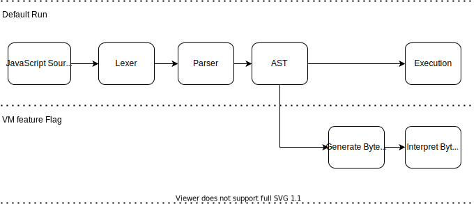

# VM (Beta)

## State Of Play

By default Boa does not use the VM branch; execution is done via walking the AST. This allows us to work on the VM branch whilst not interrupting any progress made on AST execution.

You can interpret bytecode by passing the "vm" flag (see below). The diagram below should illustrate how things work today (Jan 2021).



## Enabling ByteCode interpretation

You need to enable this via a feature flag. If using VSCode you can run `Cargo Run (VM)`. If using the command line you can pass `cargo run --features vm ../tests/js/test.js` from within the boa_cli folder. You can also pass the `--trace` optional flag to print the trace of the code.

## Understanding the trace output

Once set up you can try some simple javascript in your test file. For example:

```js
let a = 1;
let b = 2;
```

Should output:

```text
Code:
    Location  Count   Opcode              Operands
    000000    0000    DefLet              0000: 'a'
    000005    0001    PushOne
    000006    0002    InitLexical         0000: 'a'
    000011    0003    DefLet              0001: 'b'
    000016    0004    PushInt8            2
    000018    0005    InitLexical         0001: 'b'

Literals:
    <empty>

Names:
    0000: a
    0001: b


-------------------------------------- Vm Start --------------------------------------
Time         Opcode                   Operands                 Top Of Stack
64μs         DefLet                   0000: 'a'                <empty>
3μs          PushOne                                           1
21μs         InitLexical              0000: 'a'                <empty>
32μs         DefLet                   0001: 'b'                <empty>
2μs          PushInt8                 2                        2
17μs         InitLexical              0001: 'b'                <empty>

Stack:
    <empty>


undefined
```

The above will output three sections that are divided into subsections:

- The code that will be executed
  - `Code`: The bytecode.
    - `Location`: Location of the instruction (instructions are not the same size).
    - `Count`: Instruction count.
    - `Operands`: The operands of the opcode.
  - `Literals`: The literals used by the opcode (like strings).
  - `Names`: Contains variable names.
- The code being executed (marked by `"Vm Start"`).
  - `Time`: The amount of time that instruction took to execute.
  - `Opcode`: Opcode name.
  - `Operands`: The operands this opcode took.
  - `Top Of Stack`: The top element of the stack **after** execution of instruction.
- `Stack`: The trace of the stack after execution ends.
- The result of the execution (The top element of the stack, if the stack is empty then `undefined` is returned).

### Instruction

This shows each instruction being executed and how long it took. This is useful for us to see if a particular instruction is taking too long.
Then you have the instruction itself and its operand. Last you have what is on the top of the stack **after** the instruction is executed, followed by the memory address of that same value. We show the memory address to identify if 2 values are the same or different.

### Literals

JSValues can live on the pool, which acts as our heap. Instructions often have an index of where on the pool it refers to a value.
You can use these values to match up with the instructions above. For e.g (using the above output) `DefLet 0` means take the value off the pool at index `0`, which is `a` and define it in the current scope.

### Stack

The stack view shows what the stack looks like for the JS executed.
Using the above output as an exmaple, after `PushOne` has been executed the next instruction (`InitLexical 0`) has a `1` on the top of the stack. This is because `PushOne` puts `1` on the stack.

### Comparing ByteCode output

If you wanted another engine's bytecode output for the same JS, SpiderMonkey's bytecode output is the best to use. You can follow the setup [here](https://developer.mozilla.org/en-US/docs/Mozilla/Projects/SpiderMonkey/Introduction_to_the_JavaScript_shell). You will need to build from source because the pre-built binarys don't include the debugging utilities which we need.

I named the binary `js_shell` as `js` conflicts with NodeJS. Once up and running you should be able to use `js_shell -f tests/js/test.js`. You will get no output to begin with, this is because you need to run `dis()` or `dis([func])` in the code. Once you've done that you should get some output like so:

```text
loc     op
-----   --
00000:  GlobalOrEvalDeclInstantiation 0 #
main:
00005:  One                             # 1
00006:  InitGLexical "a"                # 1
00011:  Pop                             #
00012:  Int8 2                          # 2
00014:  InitGLexical "b"                # 2
00019:  Pop                             #
00020:  GetGName "dis"                  # dis
```
